```{r setup, include=FALSE}
knitr::opts_chunk$set(fig.height = 8, fig.width = 10, echo = TRUE, warning = F, error = F, message = F, comment=NA)

```

## Before we start...

-   You've got two ways to engage with this session:

1.  Just watch the screencast, let it wash over you and then come back to the materials in your own time. (These slides as well as ONS recording.)
2.  Run the R code yourself as we go. **If you're trying #2 - you'll need a copy of these slides open.** You'll have got the link via email - it's also in the chat, or just type `bit.ly/rpipelines` into your browser address bar.

-   If the slide link isn't working for any reason, you'll also have been sent a Word doc with the same material in


# Getting set up using R online (if you haven't got R yet and want to)

----

## Not got R yet?

-   If you want to do some coding but didn't have a chance to run through the little R setup guide, **you've got some time now while I do all the pre-amble.**
-   The next slide takes you through **how to get RStudio working in the browser using (free) posit.cloud.**
-   I've also stuck an **image of the 'set up posit.cloud' slide in the chat**, if useful.


------------------------------------------------------------------------

:::: {.callout-tip icon="false"}
## Get up and running with RStudio in the cloud

-   [Use this link](https://login.posit.cloud/login){target="_blank"} (or type `bit.ly/positlogin` into the address bar) to create an account at posit.cloud, using the 'don't have an account? Sign up' box. **It'll ask you to check your email for a verification link** so do that before proceeding.
-   Once verified, go back to the posit.cloud tab and log in. You should see a message: "You are logged into Posit. Please select your destination". Choose 'Posit Cloud' (not Posit Connect Cloud). **That'll take you to your online workspace.**
-   Click the **new project** button, top right
-   Select '**New RStudio project**' (as in the pic below). This will get us the **latest available R version.**

::: center
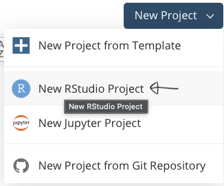{width="300px"}
:::
::::

----------------------------

## To give you a chance to get that set up...

Let me talk through some other bits:

-   We'll use the **free version of posit.cloud** - it's only got 1GB RAM, so we can't do some of the heavier stuff, but is perfect for an intro. The paid tier isn't too expensive and is powerful enough for most work.
-   Apologies - if posit.cloud doesn't work for any reason, **we won't have time during this session to troubleshoot via chat** - but we can work out ways to offer support after, if that's useful.

----

## The plan

-   We'll be building a **simple pipeline**: running through **three examples** of getting data from the web, processing it, visualising it and outputting it into a little Word report.
-   The system used for output is called [Quarto](https://quarto.org): it can also make PDFs, online reports, websites, blogs, and slides like the ones you're looking at. Follow that link to find out more.
-   We're **not** doing any web-hosted output here: we could do a future session on integrating github into your workflow, but that's a bit much for today.


------------------------------------------------------------------------

:::: {.callout-tip icon="false"}
## Get up and running with RStudio in the cloud

-   It should take less than a minute to open an RStudio project for you.
-   The R version running will be visible top-right and should be **R 4.5.2**.
-   If if isn't for any reason, you can just select that dropdown and change to R 4.5.2 now.

::: center
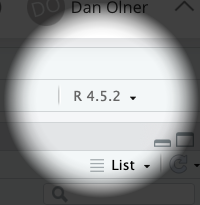{width="200px"}
:::
::::

------------------------------------------------------------------------


**You should now see RStudio open, looking something like the pic below.**

::: center
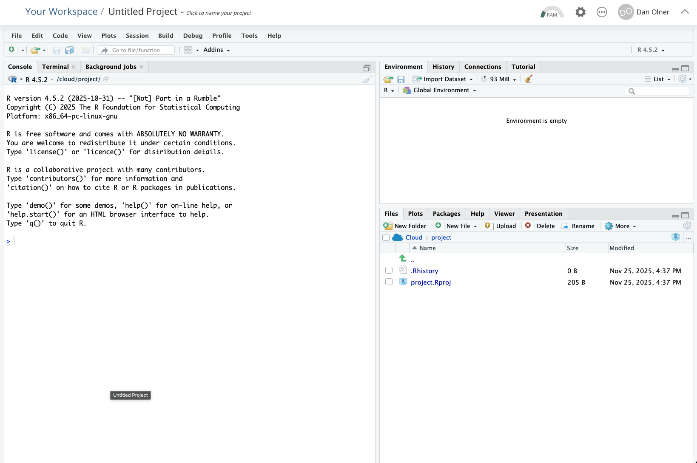{width="700px"}
:::

------------------------------------------------------------------------

::: callout-tip
## Copying code from these slides into RStudio

All code blocks here **have a little clipboard symbol if you hover over them** to quickly copy so you can paste it all into RStudio. This will come in especially handy with larger code blocks later...

```{r}

2+2

sqrt(64)

```
:::

------------------------------------------------------------------------

::: {.callout-note icon="false"}
## Task: run the setup code - copy and paste this line into the RStudio console and run it with ENTER

The first time this runs, it will **install a couple of libraries/packages we need**. It should take **a bit less than two minutes** to finish (it'll tell you how long it took).

You can follow that link (or just [go here](https://raw.githubusercontent.com/DanOlner/RegionalEconomicTools/refs/heads/gh-pages/functions/onslocal_pipeline_setup.R){target="_blank"}) if you want to see what the code's doing. We're getting the tidyverse and NOMISR packages installed, and a couple of helper functions.


```{r eval=F}
#Load some functions and install some packages
source('https://bit.ly/pipelinesetup')

```
:::

------------------------------------------------------------------------

:::: {.callout-note icon="false"}
## Pasting into the console...

... should look something like this. Press enter to run, and then we wait for nearly two minutes.

**(You'll get some warning messages - don't worry about those. If R breaks, it says ERROR not warning.)**

::: center
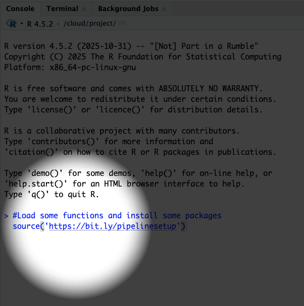{width="400px"}
:::
::::


# That gives us another two minutes for me to waffle on...


----

-   These are methods I've been developing working with [SYMCA](https://www.southyorkshire-ca.gov.uk/){target="_blank"}, [Yorkshire Universities](https://yorkshireuniversities.ac.uk){target="_blank"} and others as a [Y-PERN](https://y-pern.org.uk/){target="_blank"} policy fellow, seconded from Sheffield University. I've been compiling that work with all the open code [here](https://danolner.github.io/posts/outputs_livelist/){target="_blank"}.
-   We're now starting to use them to support other local authorities, and want to grow and improve these tools with collaboration/feedback from others
-   I've written a [blog post](https://y-pern.org.uk/blog/prototyping-open-econ-tools/){target="_blank"} on the rough plan, if of interest.

------------------------------------------------------------------------

## Because this is just a taster session...

-   This is **not a full training workshop**. Whenever we're learning new coding methods, **things always go wrong, guaranteed**. It's all part of the fun.
-   If in a workshop, we can take time to fix those problems. **Sorry, we won't have capacity for that today**.
-   The slides are designed to be step-by-step, and the session is being recorded by ONS - so you can work back through that in your own time.
-   But if you an actual supported workshop appeals, let me know: **d.olner@sheffield.ac.uk**

------------------------------------------------------------------------

-   We'll be running some chunky code blocks - especially if you're new to R **don't worry about these making sense!** Again - a workshop would be required to get into the detail.
-   The aim is just to **run them in RStudio** so you can get an idea of how this all works.
-   I will highlight a few key principles along the way, though.

## How we'll look at stuff

-   I've got **two tabs open I'll move between**. 1: These slides with the code and links in. 2: RStudio, open in posit.cloud.
-   We'll **work through these slides together**, sometimes typing or copying code from the slides into RStudio.

----

-   Given you'll also have your **own** RStudio instance open, I'm aware this could be tricky! 
-   So I'll **try to keep flitting about to a minimum**: we'll work in RStudio in big blocks, talking through the code using **#codecomments** to guide us.

----

-   Navigate the slides with the up/down or left/right keyboard arrows.
-   You can move between those two tabs, and also come back to Teams to see how I'm doing stuff.
-   Each slide is numbered - I'll say where we're at as we progress.

------------------------------------------------------------------------

## One last thing...

-   Once you have your own copy of the slides open, note the **three-bar button, bottom left**.
-   That lets you see the table of contents

Also last chance to open own slide copy! Get them at `bit.ly/rpipelines`.


# Finally some coding?

----

## Yep!

Assuming the setup code has now completed happily...

-   First job: we're going to **open the document that we'll use to draft our output**.
-   This is a 'quarto' text file with the extension 'qmd'


------------------------------------------------------------------------

:::: {.callout-note icon="false"}
## Task: open a new Quarto document

-   Use the file menu / new file and quarto document...

::: center
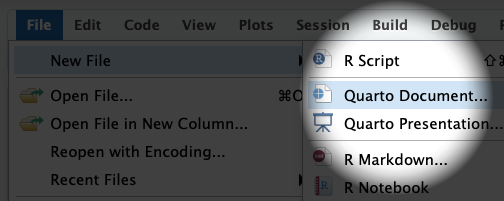{width="400px"}
:::
::::

------------------------------------------------------------------------

:::: {.callout-note icon="false"}
## Task: open a new Quarto document

-   Add in a title, and choose the 'Word' option (noting the other options we've got here)

::: center
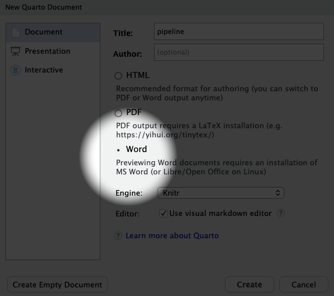{width="400px"}
:::
::::

----

:::: {.callout-note icon="false"}
## Task: try compiling the document

-   You'll see RStudio has opened a quarto doc with some examples in.
-   Let's just try compiling this, so you can see what happens. We'll do exactly the same for our pipeline, just with more code in.
-   So: **click on the Render button above the script**.
-   You may see a warning, just cancel that.


::: center
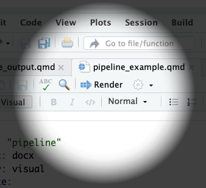{width="300px"}
:::
::::

----

## The rendered document should now be in your RStudio project's files

-   You can download that docx file by selecting its box and then choosing 'export' by clicking the little cog, top right (see pic).

::: center
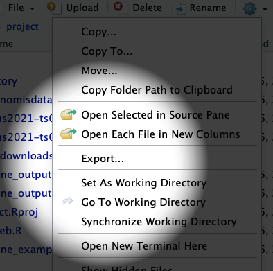{width="300px"}
:::


----

:::: {.callout-note icon="false"}
## Task: copy this code and paste it just below 'editor: visual' in the quarto doc

-   This sets up some figure output choices and stops the doc from outputting all the R code and messages.

```{r eval = F}
execute:
  echo: false
  message: false
  warning: false
fig-dpi: 300
fig-width: 8
fig-height: 5

```

::::

----

:::: {.callout-note icon="false"}
## Task: delete all the boilerplate code so we can start fresh

-   Just all the headings and code in the main part of the doc. We'll be writing our own.

::::

----

:::: {.callout-note icon="false"}
## Task: then we add in our own **setup code**

-   To do this, let's (1) **make a new R code block** (with code/insert chunk, see below - or use the shortcut) 
-   Then (2) **give it a name** and (3) **paste in the code below.**
-   Don't worry about the setup code: it won't run for 2 minutes again. We just need it for some functions.

```{r eval = F}
#Load some functions and install some packages
source('https://bit.ly/pipelinesetup')

library(tidyverse)
library(nomisr)
library(xml2)

#Set ggplot theme
theme_set(theme_light())


```

::: center
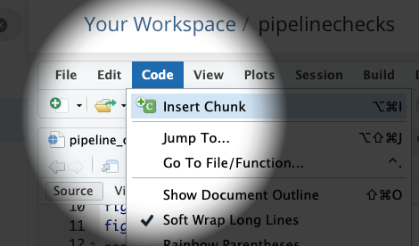{width="300px"}
:::


::::


----

## Once that's done, we can just write some headings and text

-   Quarto has both a visual and source mode, for editing in different ways
-   **'Source'** shows the text file - we can add headings with hashes, or do in **'Visual mode'** and use the formatting options

Let's also add a heading in for our **first web data import** (something like 'Extracting from an Excel file') 


# Example one: extracting from an online Excel file

----

:::: {.callout-note icon="false"}
## Task: now **make another code block** as we did before

-   This will be our first pipeline section. **Once we've made it, we'll add in the code below.**
-   (Don't worry about the code running off the slide below - it'll still copy with the clipboard symbol.)

Here's the code to copy into our new R code block:

```{r eval=F}
# 1. Extracting from an Excel file on a website: productivity data example

# Copy the URL for the Excel sheet from the ONS website
# This is just setting a string named 'url'
url <- 'https://www.ons.gov.uk/file?uri=/employmentandlabourmarket/peopleinwork/labourproductivity/datasets/subregionalproductivitylabourproductivitygvaperhourworkedandgvaperfilledjobindicesbyuknuts2andnuts3subregions/current/labourproductivityitls1.xlsx'

# We then create a TEMPORARY FILE...
temp_path <- tempfile(fileext=".xlsx")
# And use that file path to DOWNLOAD A TEMP COPY OF THE EXCEL TO USE
download.file(url, temp_path, mode="wb")

# Or if you want to keep a local, month-dated version in case it changes later...
# download.file(
#   url,
#   paste0('ONS_outputperhourdata-',format(Sys.Date(),'%b-%Y'),'.xlsx'),
#   mode="wb")

# READ FROM THE EXCEL SHEET
# This goes straight into a dataframe
# Read directly from a specific sheet and range of cells from the downloaded file
# "Table A1: Current Price (smoothed) GVA (B) per hour worked indices; ITL2 and ITL3 subregions, 2004 - 2023"
cp.indices <- readxl::read_excel(path = temp_path,range = "A1!A5:W247")

# TAKE A LOOK AT THAT DATA (CLICK ON ITS NAME IN THE ENVIRONMENT PANEL)
# It's got each year IN ITS OWN COLUMN. Not what we want.

# So we RESHAPE
# Get just ITL3 level and pivot years into their own column

# An aside: 
# This symbol - %>% 
# Is a PIPING OPERATOR
# It lets us pipe one operation to the next
# So we can clearly see each step taken
# Let's number those steps here

#1. Pipe the data into a filter
#2. filter down to just ITL3 zones
#3. pivot long so years are in their own column
#4. Convert year to a sensible format
#5. Remove the ITL column, we don't need that now
# And back on the first line, overwrite the original dataframe
cp.indices = cp.indices %>% 
  filter(ITL_level == 'ITL3') %>% 
  pivot_longer(Index_2004:Index_2023, names_to = 'year', values_to = 'index_value') %>% 
  mutate(
    year = substr(year,7,10),
    year = as.numeric(year)
  ) %>% 
  select(-ITL_level)


# We're going to plot JUST THE UK CORE CITIES
# Here's a list of those I made earlier...
corecities = readRDS(gzcon(url('https://github.com/DanOlner/RegionalEconomicTools/raw/refs/heads/gh-pages/data/corecitiesvector_itl3_2025.rds')))

# Check match...
# Note, this is commented out (so it doesn't output in our final doc)
# BUT we can still run it to check by highlighting the code
# table(corecities %in% cp.indices$Region_name)

# Plot!
# Filter down to the core cities
# And reorder the places by which has the highest average index over all years
ggplot(
    cp.indices %>% filter(Region_name %in% corecities),
    aes(x = year, y = index_value, colour = fct_reorder(Region_name,index_value,.desc = T))
    ) +
  geom_line() +
  geom_hline(yintercept = 100) +
  scale_color_brewer(palette = 'Paired') +
  theme(legend.title=element_blank()) +
  ylab('Output per hour: 100 = UK av')

```

::::

----

That link to the Excel sheet in the code has been copied directly from the ONS subregional productivity webpage [here](https://www.ons.gov.uk/employmentandlabourmarket/peopleinwork/labourproductivity/datasets/subregionalproductivitylabourproductivitygvaperhourworkedandgvaperfilledjobindicesbyuknuts2andnuts3subregions){target="_blank"}...

::: center
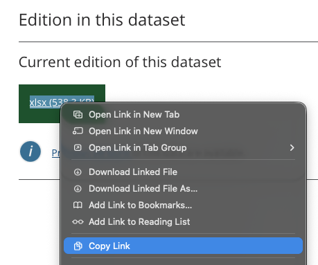{width="300px"}
:::

----

But you do need to do into the Excel file itself to **look** at what sheet and cell range you need. That only needs doing once though.

We're going to use the **very first sheet**: A1, current prices smoothed.

::: center
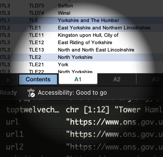{width="200px"}
:::


## Let's move to RStudio to run through the first example

We can run each bit of the code **inside the quarto doc** (to make sure everything works as we want and see the outputs) as well as run the whole thing to compile the final doc.


# Example two: using the NOMISR package to get data from NOMIS

----

## We're going to do something slightly different for this one

-   Often, getting the data wrangled can be time-consuming (due to either download or processing times)
-   We don't want to have to go through that every single time the Quarto doc compiles.
-   One way to solve this: **do the processing in a *separate script*, save it, then let the Quarto doc re-load the finished product**.

----

::: {.callout-note icon=false}
## Task: so let's open a new R script in RStudio and do the NOMISR work there

* In the **file** menu in RStudio
* Use **new file** and **R script** (note: it tells you the keyboard shortcut for this)

::: {.center}
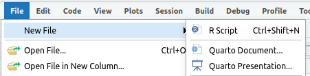{width="200px"}
:::

:::

----

:::: {.callout-note icon="false"}
## Task: then we paste the NOMISR code below into our new script

-   And we'll go through it in RStudio again

```{r eval=F}


```


::::


----


----

::: center
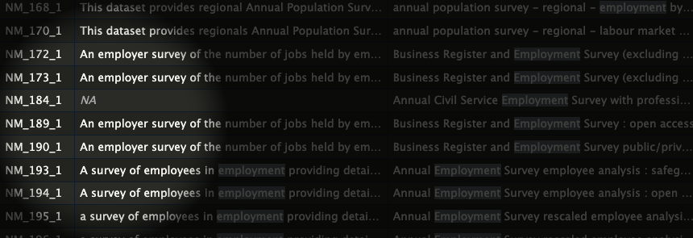{width="200px"}
:::

----

::: center
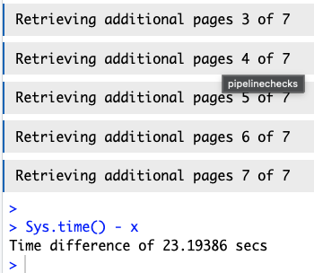{width="200px"}
:::


----

NOMIS [bulk Census 2021 download page](https://www.nomisweb.co.uk/sources/census_2021_bulk)


::: center
{width="200px"}
:::


----


----

UTLAs LTLAs

Census 2021 [geography definitions](https://www.ons.gov.uk/census/census2021dictionary/areatypedefinitions) upper vs lower tier local authorities


----


