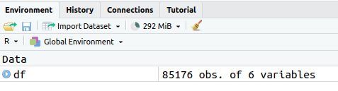
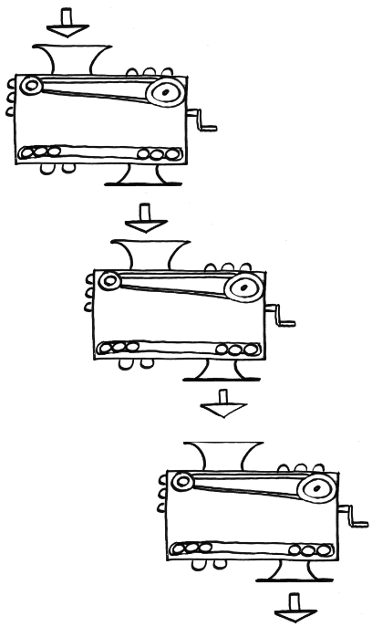

```{r setup, include=FALSE}
knitr::opts_chunk$set(fig.height = 8, fig.width = 10, echo = TRUE, warning = F, error = F, message = F, comment=NA)

```

## Introduction

We'll be doing a **whistlestop tour** of using R for regional economic analysis of UK data. It's the source we'll run through in the June '25 [ONS Presents taster session](https://www.eventbrite.co.uk/e/ons-local-workshop-using-r-for-regional-economic-analysis-taster-session-tickets-1372930745819).


----

* **If anyone hasn't already got set up with R, I'll talk for a couple of minutes now and give you a chance to create an account on posit.cloud. Just follow the three steps below and you'll be ready to go**


::: {.callout-tip icon=false}

## Get up and running with RStudio in the cloud

* [Create an account at posit.cloud](https://login.posit.cloud/login) using the 'sign up' box, and then log in. That'll take you to your online workspace.
* Click the **new project** button, top right
* Select '**new project from template**' (as in the pic below) and then "Data Analysis in R with the tidyverse" (if not already selected). This template comes pre-installed with the tidyverse package, which we'll be using. Select then click OK down at the bottom. **This will open your RStudio project where we'll do the coding.** 

::: {.center}
{width="200px"}
:::

:::

----

## Pre-amble

* First, apologies - because this is just a taster, we won't be able to check in on everyone's progress to make sure it's working or making sense! I've designed the guide so it can be followed step by step - but if we lose you along the way, we've also got a poll and ways to stay in touch, if I can help to support outside of this session.

---

* If this happens, we'll still run through some of things R can do, and we can set up support later...
* That could include smaller groups where making sure it's working will be possible!
* The aim: this should work for anyone completely new to RStudio. May veer from insultingly simplistic to horribly complex

---

* This is a whistlestop tour - if you're new to any of this, don't worry about it making sense on first go! I'll just try to highlight what R can do, and provide pointers to learning more.
* Sometimes things won't work... [explain]
* Bugs and errors, explain.
* I will pick out one or two basic R things to highlight, but missing a load... [e.g. piping / functions]
* Other things...

## The plan

* We'll **work through these slides together**, sometimes typing or copying code from the slides into RStudio.
* So I'll be **flitting between the slides and RStudio myself** to do the same steps you'll be trying.
* That could be vexing if you're trying to look at slides! So **make sure you have your own version of the slides open the a browser.** I'll post a link to it in the chat.
* Each slide is numbered - I'll say where we're at as we go on

---

* If you **don't fancy constantly flitting between slides and RStudio** I've also made a single copy of the whole script we'll work through, which you can get here (click on the little clipboard symbol top-right to copy, and then when we make a script below, paste the whole thing in).
* I'll provide that link again below after we've made a script.
* Numbers in the comments on the script will (should!) match the slides so you can just follow along in RStudio.

## The slides

* Once you have your own copy of the slides open, note the **three-bar button, bottom left**. 
* That lets you see the full contents


# CODING TIME!

## Making a new R script in RStudio

**RStudio is where you'll be doing all the R loveliness** (though see also the spangly new [positron](https://positron.posit.co/), I haven't tried yet).

Before looking at RStudio, let's **make a new R script, where we'll do the coding**.


::: {.callout-note icon=false}

## Task: Open a new R script in RStudio

* In the **file** menu in RStudio
* Use **new file** and **R script** (note: it tells you the keyboard shortcut for this)

::: {.center}
{width="200px"}
:::

:::

---

After that new file's been made, RStudio should look something like the pic below.


# Tour of RStudio / getting set up

## 1. The console

The **console** is **bottom left**: all R commands end up being run here. You either **run code directly in the console** or **send code from your R script.**

::: {.callout-note icon=false}

## Task: enter some commands directly into the console

**Click in the console area** so the cursor is on the command line. Type some random sums (or copy, see next slide) - **press enter and you'll see the results directly in the console.**

Note that second one: `sqrt` is a **function** and arguments go into the brackets. More on that in a mo.

```{r}

2+2

sqrt(64)

```

:::

---

::: {.callout-tip}
## Copying code from these slides into RStudio

All code blocks here **have a little clipboard symbol if you hover over them** to quickly copy so you can paste it all into RStudio. This will come in especially handy with larger code blocks later...


```{r}

2+2

sqrt(64)

```

:::


## 2. Giving things names

We can assign all manner of things a **name** to then use them elsewhere: values, strings, lists - **and, crucially, data objects like all the UK's regional GVA.** But these **all use the same method.**

::: {.callout-note icon=false}

## Task: Still in the console, assign a value to a name

```{r}
x = 64
```

You'll see that assignment appear **top right in RStudio**. It can be retrieved just with:

```{r}
x
```

:::


## 3. Using an R script

**We'll now stick some code into that newly created R script we made earlier in the top left of RStudio.** 

All code will run in the console - what we do with scripts is just send our written/saved code *to* the console. 

Let's test this by **adding code to load the tidyverse library**.

::: {.callout-tip}
## What's the tidyverse?

It's a basket of tools that have become part of the R language - they all fit together to make consistent workflows **much** easier.

The online book [R for Data Science](https://r4ds.hadley.nz/) is a great source to learn it, by the person who started it.

:::

---

::: {.callout-note icon=false}

## Task: add a line of code to the R script

Type or paste the following text at the top of the newly opened R script in the top left panel. 

```{r eval = F}
library(tidyverse)
```

When you've put that in, **the script title will go red**, showing it can now be saved (it should look something like the image below).

::: {.center}

:::

* **Save the script** either with the CTRL + S shortcut, or file > save. Give it whatever name you like, but note that it **saves into your self-contained project folder.**

:::


---

::: {.callout-note icon=false}

## Task: Run the `library(tidyverse)` line

**Now we need to actually run that line of code... we can do this in a couple of ways:**

1. In your R script, if **no code text is highlighted/selected** RStudio will **Run the code line by line** (or chunk by chunk - we'll cover that in the taster session).
2. **If a block of text is highlighted**, the whole block will run. So e.g. if you select-all in a script and then run it, **the entire script will run.**

Let's do #1: **Run the code line by line**.

* **To test this, we'll load the tidyverse library with the code we just pasted in** (which is just one line of code at the moment!) Put the cursor at the end of the `libary(tidyverse)` line in the script (if it's not there already), either with the mouse or keyboard. (Keyboard navigation is mostly the same as any other text editor like Word, but [here's a full shortcut list](https://support.posit.co/hc/en-us/articles/200711853-Keyboard-Shortcuts-in-the-RStudio-IDE) if useful.)
* Once there, either use the 'run' button, top right of the script window, or (much easier if you're doing this repeatedly) **press CTRL+ENTER to run it.**

:::


---

**If all is well, you should see the text below (or similar) - the tidyverse library is now loaded. Huzzah!** 


::: {.center}

:::


# Finally - some economic data! Phew!

## Well nearly...

**Just one more thing first before actual economic data, sorry. We're just going to **load some functions (and install a couple of libraries) that we'll need (i.e. Blue Peter style "here's some I made earlier" chunks of code...) If of interest (or you want to check the code isn't stealing your bank details!) code for these functions are [on the github site here](https://github.com/DanOlner/RegionalEconomicTools/blob/gh-pages/functions/misc_functions.R).

::: {.callout-note icon=false}

## Task: In the R script, stick this code below the `library(tidyverse)` line and run it with CTRL+ENTER or the run command

As this will **install a couple of libraries for the first time** it'll take about **25-30 seconds** to run.

**Note: comments in R begin with a #hash.**

```{r}
#Load some functions and load two libraries (and install them if they're not already present)
source('https://bit.ly/rtasterfunctions')

```

::: 


---

Right - **now we can load some economic data**. Let's load it first, then we'll talk through what it is.

::: {.callout-note icon=false}
## Tasks: get some regional economic data! Then look at it in RStudio.

This line takes a **comma-separated variable file from the web** and names it / assigns it to `df`.

Paste it into your script (below the other code we've added) and run it. 

If you **look at the environment pane, top right**. `df` should now be there (as in the pic below).

Then try this: **click anywhere on that line in the environment pane** - it'll open a **new tab in RStudio** with a view of the data attached to `df`.

```{r}
# LOAD ITL3 GVA DATA----

#ITL3 zones, SIC sections, current prices, 2023 latest data
df = read_csv('https://bit.ly/rtasteritl3')
```

:::


::: {.center}

:::


## What data have we got here?

This is from the latest ONS **"Regional gross value added (balanced) by industry: all International Territorial Level (ITL) regions"** (The Excel file is [available here](https://www.ons.gov.uk/economy/grossvalueaddedgva/datasets/nominalandrealregionalgrossvalueaddedbalancedbyindustry)). Released April 2025, it's got data up to 2023. It's got:

* ITL3 zones i.e. local authorities rather than MCAs
* SIC sections: 18 broad sector categories
* 1998 to 2023

Let's look at those in R...

---

::: {.callout-note icon=false}
## Task: look at what SIC sector categories are in the data

We can do this by pulling out the unique values from a column.

In R, there are **different ways to refer to columns.** Here's a key one: use the name, then a dollar sign. R will then let you autocomplete the column name.

```{r}
unique(df$SIC07_description)
```

:::

---

**"R is brilliant" exhibit A: we can use it to automate tedious things.**

Here's a sample of what the data looks like in the original Excel file. Different SIC sector levels are nested, there's one column per year.

::: {.center}

:::


---

* The data in `df` comes from that ONS Excel sheet
* I've used R to get it directly from the web and then extract each CSV separately that might be needed
* Including separating sectors by type: goods/services, sections, the full SIC list (45 sectors in this data)
* So that's the **first part of the pipeline**: extracting the data from source and getting into a nice useable form.


---

## Location quotients

Earwig go!

::: {.callout-note icon=false}
## Task: 


```{r}
# LOCATION QUOTIENTS/PROPORTIONS----

add_location_quotient_and_proportions(
  df %>% filter(year == 1998),
  regionvar = Region_name,
  lq_var = SIC07_description,
  valuevar = value
) %>% glimpse
```

:::


# Piping interlude!

---

```{r eval=F, echo=F}
#Piping image from
#https://s3.amazonaws.com/conference-handouts/2015-nctm-boston/pdfs/Fun%20Functions%20Handout%202013.pdf
```


::: {.callout-note icon=false}
## Task: compare standard R function to 'piping in' the argument


```{r}

#standard functions look like e.g.
sqrt(100)

#But we can also PIPE the number INTO the function...
100 %>% sqrt

#Which seems pointless, except we can now CHAIN FUNCTIONS

```

:::


{width="250px"}

---


::: {.callout-note icon=false}
## Task: 

While we're here: **highlight just this bit of code: `df %>% group_split(year)` and then run**. We can see what just that chunk is doing exactly what the function name suggests.

```{r}
#Finding location quotients for each year in the data 
#And then overwriting the df variable with the result
df = df %>% 
  group_split(year) %>%
  map(add_location_quotient_and_proportions, 
      regionvar = Region_name,
      lq_var = SIC07_description,
      valuevar = value) %>% 
  bind_rows()
```

:::

---

::: {.callout-note icon=false}
## Task: 

```{r}
#View a single place...
df %>% filter(
  qg('rotherham',Region_name),
  year == max(year)#get latest year in data
) %>% 
  mutate(regional_percent = sector_regional_proportion *100) %>% 
  select(SIC07_description,regional_percent, LQ) %>% 
  arrange(-LQ) 

```

:::

---

Cheatsheets!

---


## How has the structure of [x and y] economies changed over time?


::: {.callout-note icon=false}
## Task: 

```{r}
smoothband = 3

df <- df %>% 
  group_by(Region_name,SIC07_description) %>% 
  mutate(
    gva_movingav = rollapply(value,smoothband,mean,align='center',fill=NA),
    sector_regional_prop_movingav = rollapply(sector_regional_proportion,smoothband,mean,align='center',fill=NA)
  ) %>% 
  ungroup()

place = qgp('rotherh',df$Region_name)
  
  
#top 12 sectors in latest year
top12sectors <- itl3.sections.cp %>% 
  filter(
    Region_name == place,
    year == max(year) - 1#to get 3 year moving average value
  ) %>% 
  arrange(-sector_regional_prop_movingav) %>% 
  slice_head(n= 12) %>% 
  select(SIC07_description) %>% 
  pull()

#Plot! 
leedsplot <- ggplot(itl3.sections.cp %>% 
                      filter(
                        Region_name == place, 
                        # SIC07_description %in% top12sectors,
                        !is.na(sector_regional_prop_movingav)#Remove NAs created by 3 year moving average
                      ), 
                    aes(x = year, y = sector_regional_prop_movingav * 100, colour = fct_reorder(SIC07_description,-sector_regional_prop_movingav) )) +
  geom_point() +
  geom_line() +
  # scale_color_brewer(palette = 'Paired', direction = 1) +
  scale_color_manual(values = setNames(randomcols,unique(itl3.sections.cp$SIC07_description))) +#set manual pastel colours matching sector name
  ylab('Sector: percent of regional economy') +
  theme(plot.title = element_text(face = 'bold')) +
  labs(colour = 'SIC section') +
  # scale_y_log10() +
  ggtitle(paste0(place, ' GVA % of economy over time (', smoothband,' year moving average)'))

```


:::


```{r cuttinz, eval=F, echo=F}

#* **Follow [this little guide here](https://danolner.github.io/posts/setting_up_w_r_online/#if-using-rstudio-online-set-up-a-posit.cloud-account-and-create-your-rstudio-project){target="_blank"} to do that (opens in new tab).**


```

