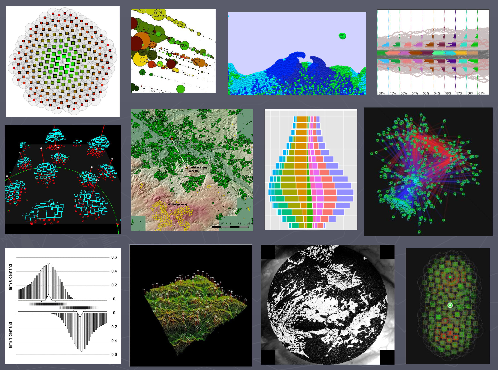
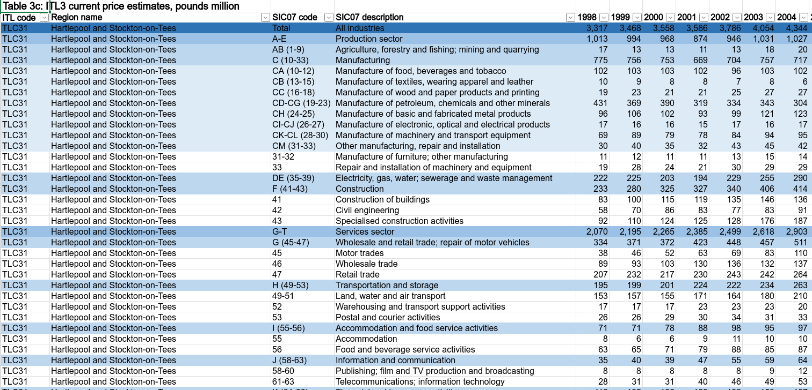
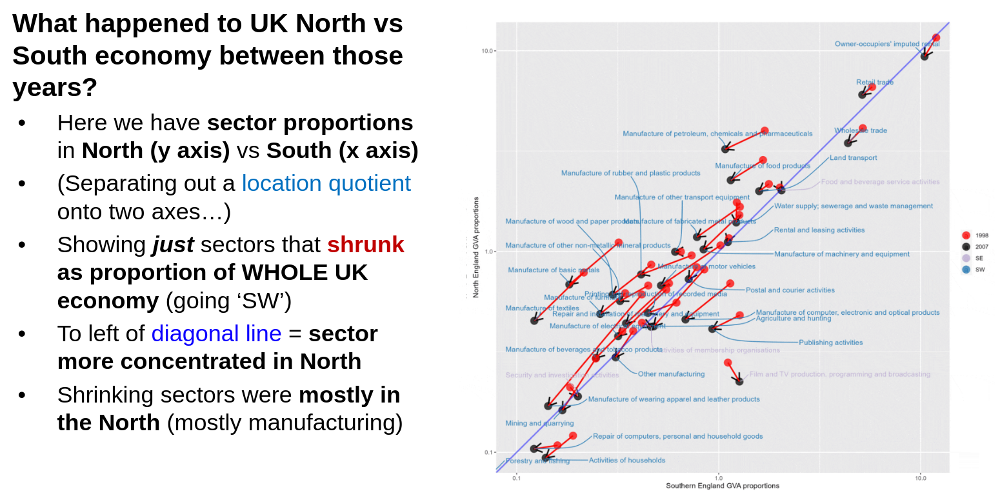
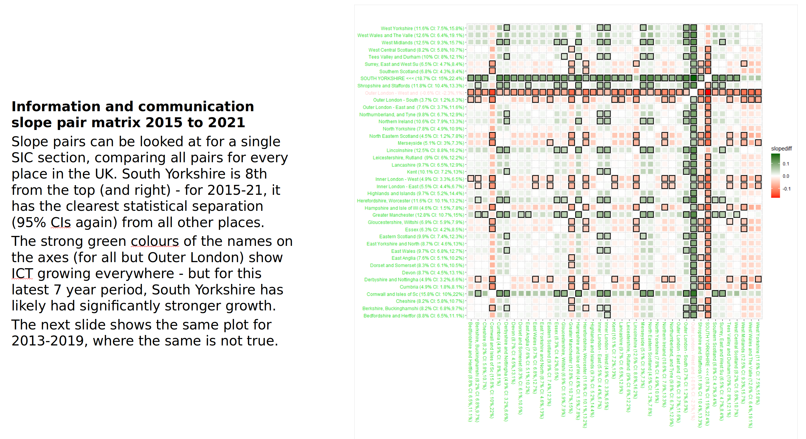
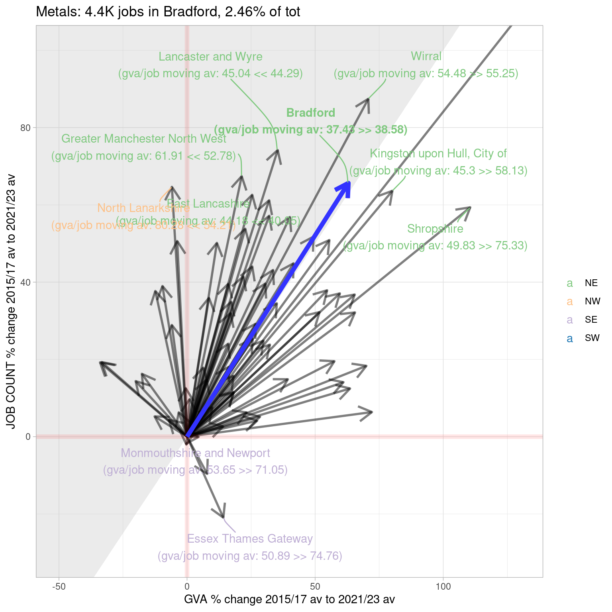
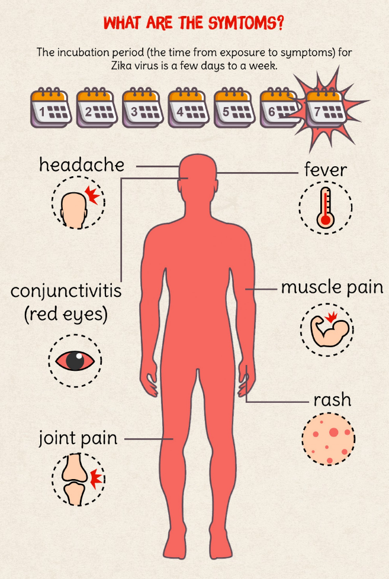

```{r setup, include=FALSE}
knitr::opts_chunk$set(fig.height = 8, fig.width = 10, warning = F, error = F, message = F, comment=NA)

#Bits!
#`bit.ly/rtasterslides`

```

# INTRO

## Slides!

They're online here if you want quick access to the links: [bit.ly/ypernsymca](https://bit.ly/ypernsymca){target="_blank"}

## Y-PERN: "Yorkshire & Humber Policy Exchange and Research Network"

::: {.center}
{width="400px"}
:::

## Y-PERN...?

* Research England funded
* Aim: to **experiment** with ways of strengthening glue between Y&H universities, regional authorities and communities
* So still open question - what's worked, what hasn't??
* Diverse range of things happened/happening across the region - see [y-pern.org.uk](https://y-pern.org.uk/){target="_blank"}

## South Yorkshire

* Me: seconded to SYMCA 2 years ago
* Working also with Hallam team (Peter Wells, Elizabeth Sanderson, Jamie Redman)
* I'm an economic geographer / data scientist by background (with some political studies thrown in)
* And a big fan of making pretty data pictures to try and see it / understand it in different ways...

---

::: {.center}
{width="800px"}
:::


## SYMCA work!

* Plan: I'll run through examples of what I've worked on in my time with SYMCA
* Picking ones that I think tell a story
* These will almost all be various plots, interative maps, dashboards, that kind of thing
* But just a few thoughts on working openly...

## Why work openly?

* Not all data work **can** be done openly. But a lot can, and I think **there are compelling reasons to work this way**:
    - It supports collaboration and learning (bootstrapping capacity building, everyone bringing their expertise)
    - It will help build a shared sense of ground truth
    - It will avoid wheel reinvention (reproducibility **needs** this)
* Where possible, build **automated pipelines** from data source to output
    - E.g. below, R reads data directly from Excel files on the web
* Will come back to this in discussion: ideal vs reality?


## Use all the data where possible!

* By which I mean:
* A big part of the 'so what' of any data analysis is "where does this place sit nationally?"
* So if poss, always **analyse national-level data and put a place in context**
* With open methods / code, this is usually just as easy as not doing it
* Something e.g. [fingertips data](https://fingertips.phe.org.uk/){target="_blank"} already does well


# DATA AND PLOTS AND STUFF

## ONS Regional GVA data (latest 2023)

* Super-rich, compact dataset - a pain to drag insights out of
* If I had a favourite Excel document...
* First SYMCA ask: show what's happened / happening to SY sectors

## ONS Regional GVA data (latest 2023)

Here's what it looks like in its Excel home:

::: {.center}
 
:::


## GVA data 1: structural change '98 to '07

::: {.center}
 
:::

## Location quotients a-go-go

* Interactive [here](https://danolner.shinyapps.io/EconDataDashboard/){target="_blank"} or [bit.ly/lqecondash](https://bit.ly/lqecondash){target="_blank"}
* While that's loading...
* LQs: a nice way to summarise where sectors are relative to the rest of the UK
* LQ > 1 = sector more concentrated in a place than in the UK as whole
* E.g. if South Yorkshire fab metals manufacture is 10% of our economy and that sector is 5% of the UK's as a whole, its LQ = 2.
* (LQ < 1 = opposite)

## Growth! What grew more than where?

* Inflation-adjusted (chained volume) GVA for this one. Will make proper statisticians have kittens I think, but...
* And cramming as much as possible into a single image!

## Growth! What grew more than where?


::: {.center}
 
:::


## Business Register and Employment Survey (BRES)

* Job counts down to 5-digit SIC categories (723 of them)
* Survey based, so gets more uncertain, but...
* We can see how the different SIC sector levels nest -->
* [Interactive](https://danolner.github.io/RegionalEconomicTools/miscdocs/SYLAs_CompaniesHouse2025_treemap.html){target="_blank"}: job counts at different sector levels for latest year in South Yorkshire. [bit.ly/bres_sy](https://bit.ly/bres_sy){target="_blank"}


## Combining GVA and BRES for GVA per worker (Bradford example)

::: {.center}
 
:::


## ONS hourly productivity data for 2023: first time we get SY 4 places separately in GVA data

* ITL3 zones in 2025 used for latest 2023 data - we get all four places separated now
* Can see slightly different productivity story for Rotherham vs Doncaster
* [Link](https://danolner.github.io/RegionalEconomicTools/quarto_docs/productivity_bitsandbobs_June2025.html){target="_blank"}


## Making Companies House data open

* UK Companies House data is already ‘open’ but it’s opaque and a [PITA](https://dictionary.cambridge.org/dictionary/english/pita){target="_blank"} to wrangle.
* Other firms package it up and resell it in useable form but access is limited e.g. < 30K rows
* A lot of value in having entire dataset to play with - it's amazingly rich (though with weaknesses e.g. only HQ'd firms misses a lot)


## CH 1: hexmap of most common broad sector

* 5000m hex, 50+ employees min per firm - [link](https://danolner.github.io/companieshouseopen/maps/companieshouse_modal_SICsection_byemployeecount_minfiftyplus_hex5000.html){target="_blank"}! 
* Manufacturing doughnut and Southern Professional/sci/tech belt
* [Higher res](https://danolner.github.io/companieshouseopen/maps/companieshouse_modal_SICsection_byemployeecount_min10plus_hex1000m_wLADs.html){target="_blank"} for zooming in - 1000m and min 10 employees per firm. Less informative of GB econ structure?  


## CH2: South Yorkshire dashboard

* [Link](https://bit.ly/sy_ch){target="_blank"} and also [bit.ly/sy_ch](https://bit.ly/sy_ch){target="_blank"}


## CH3: Percent change in firm employee counts by sector (West Yorkshire example!)

* [Link](https://danolner.github.io/RegionalEconomicTools/quarto_docs/LeedsBradford_overview_May2025.html){target="_blank"}


# RAMBLING THOUGHTS

## 


## Where's the stuff?

* So all this work/code is openly available (including some training materials)
* [github.com/DanOlner](https://github.com/DanOlner){target="_blank"} for code (and where all the web stuff resides, including these slides)
    - Some re-used for the [Yorkshire Engagement Portal](https://yorkshireportal.org/){target="_blank"}
* "[Regecontools](https://danolner.github.io/RegionalEconomicTools/){target="_blank"}" website where I'm trying to corral all the regional economics work and learning. (bit.ly/regecontools gets there too.)
* An [outputs live list](https://danolner.github.io/posts/outputs_livelist/){target="_blank"}: a reasonably complete list of all data, code and outputs


# CUTTINGS

# Data viz prelude: what's the difference between an x-ray and an infographic?

## X-ray

"At first the student is completely puzzled..."

::: {.center}
 
:::


## Infographic

::: {.center}
 
:::


