```{r setup}
library(tidyverse)
library(sf)#for geo stuff
library(tmap)#for mapping
library(zoo)#for making smoothed moving averages
library(patchwork)#combine ggplots easily
library(plotly)#For interactive plots
library(RColorBrewer)

source('../functions/misc_functions.R')
source('../functions/adhoc_functions.R')
#source('functions/misc_functions.R')
#source('functions/adhoc_functions.R')

options(scipen = 999)

# Data for this side of reality
itl3.ynh = readRDS('../local/data/itl3ynh.rds')
itl1.summedtoitl3SICs = readRDS('../local/data/itl1summedtoitl3SICs.rds')
bres.gva.2d = readRDS('../local/data/bresgva2d.rds')

ynhshortnames = readRDS('../local/data/ynhshortestnames.rds')

# For mapping
mask = readRDS('../local/ynhmask.rds')
itl3.ynh.zones = readRDS('../local/itl3ynh.rds')

sq = readRDS('../local/data/sq.rds')
hexsummary = readRDS('../local/hexsummary_for_dictionary.rds')

tmap_mode('plot')

```

# INTRODUCTION

This Document presents visualisations of economic data for the 43 sector categories avaiable in the ONS GVA by industry data for ITL1-level geographies like Yorkshire and The Humber.

Each sector category has its own section - these are on the right hand side of the page and can be used for navigation.

See below for a guide on reading the location quotient plots.

For each of those sections, there are four plots:

1.  The top plot shows the GVA location quotient for Yorkshire and The Humber as a whole for that sector, with other UK regions shown in squares. **All sections are ordered by this LQ value, with the highest first - i.e. the sector that is on average most concentrated in Y&H**.
2.  The plot below this shows LQ's for each of Y&H's ITL3 zones, showing the diversity of sector concentration within the region. Many sectors will not have high average LQs at the Y&H level, but some sub-regions here do (and vice-versa). The ITL3 with the highest LQ within the region is at the bottom of the plot.
3.  These are productivity plots: they puts percent change in GVA on the X axis against full-time job percent change on the Y axis, with the start end points being the three-year average of 2015/17 to 2021/23. Y&H ITL3s are overlaid in blue (with a two letter label) if this sector makes up 1.5% or more of its economy. Several things can be read here:

-   Any arrow with an endpoint within the **lighter grey diagonal area** has increased its productivity (in terms of GVA per full-time job). Conversely, if the arrow lands in the darker great diagonal, GVA per full-time worker has dropped between those two timepoints.
-   Increases in productivity can come about in three different ways: an arrow pointing Northeast in the lighter diagonal area has seen *both* GVA and job count go up; and arrow pointing Southeast has seen productivity increase through a combination of GVA going up and job count going down; an arrow pointing Southwest (in the light diagonal area) I seen GVA drop proportionally less than jobs, thus still increasing productivity (by this measure).

4.  The last plots are hexmaps for each sector across Y&H based on employee accounts from the latest Companies House data (covering the year from September 2024 to October 2025). Each hex shows LQ sector concentration **relative to the rest of Yorkshire and Humber** - bluer zones are less concentrated than the regional average, red zones more concentrated. A hex is included only if it has 10 or more employees for that sector. (The log of LQ values is used for these maps as it is symmetrical between more or less concentrated. For log LQ, zero is the 'concentration is the same as regional average' value, not 1.)

## Location quotient plot guide

The first two outputs for each section are **location quotient plots**. Here's a guide to reading them:

-   Location quotients show the ratio of a sector's size within a place compared to a larger geography's average - here, Y&H and its sub-regions are compared to the rest of the UK (minus London, see below).
-   Sectors to the right of the centre line are more concentrated in this region when compared to the national average. (e.g. LQ = 10, it is 10x more concentrated).
-   Green circles have been increasing in concentration over time (larger circles increasing the most)
-   Red circles have been decreasing in concentration over time (larger circles decreasing the most)
-   Black horizontal lines show the min and max of concentration in the data’s history (from 2015 to 2023)
-   Circles and lines can be read together - for example, if a green circle is at the right of this line, sector job concentration has been increasing on average and is continuing.
-   Per ITL3 GVA values and percent of the total zone economy are shown with the place name. These are useful to check sector size versus LQ - for example, a sector like jewellery can have a high LQ (as it does in Sheffield and Birmingham) with very low job counts, because there aren't many jobs in this sector overall in Great Britain.

## Data notes

-   GVA data is from the [latest ONS GVA by industry](https://www.ons.gov.uk/economy/grossvalueaddedgva/datasets/nominalandrealregionalgrossvalueaddedbalancedbyindustry) collection - 2023 is the most recent year. The number of sector categories is slightly different for different geographical scales – to compare ITL1 and ITL3 geographies, ITL1 GVA has been binned into the fewer number of ITL3 SICs. BRES job count data and Companies House data have both been binned into the same SIC categories.

-   LQ plots use 'current price' data, which can be summed to find regional GVA proportions. The percent change job vs percent change GVA plots, on the other hand, use 'chained volume' GVA measures that reflect 'real' economic growth - the GVA percent changes here represent real, not just nominal, economic growth.

-   For the main LQ plots, the ITL1 zone for London has been excluded. This is because the size of London's economy warps location quotients for the rest of the UK. For example, if London is included, LQ values for creative sectors are all below one for everywhere except London.

-   All plots except the maps analyse data between 2015 and 2023, using a three-year moving average.

## SECTOR CATALOGUE---


## Manufacture of furniture; other manufacturing

### LQ gva/job plots


```{r, fig-Manufactureoffurnitureothermanufacturing}
#| fig-width: 8
#| fig-height: 15

p = ynh_autoplots("Manufacture of furniture; other manufacturing")


# Text for adding to qgm document to plot the three combined plots
if(!is.null(p[[3]])){
  
  plottosave = p[[1]] / p[[2]] / p[[3]] + patchwork::plot_layout(heights = c(3, 12, 12))
  
} else {
  
  plottosave = p[[1]] / p[[2]] + patchwork::plot_layout(heights = c(3, 12))
  
}

plottosave


```


### Map: within-Y&H micro-LQ for 2024/25


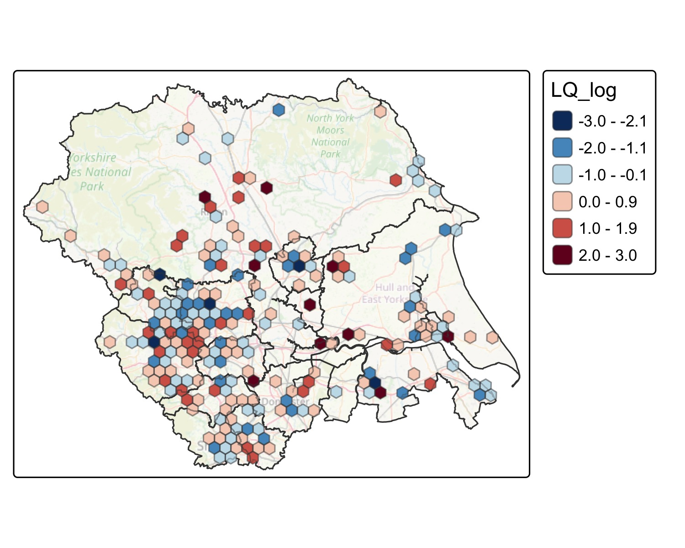{width="700px"}


## Manufacture of textiles, wearing apparel and leather

### LQ gva/job plots


```{r, fig-Manufactureoftextileswearingapparelandleather}
#| fig-width: 8
#| fig-height: 15

p = ynh_autoplots("Manufacture of textiles, wearing apparel and leather")


# Text for adding to qgm document to plot the three combined plots
if(!is.null(p[[3]])){
  
  plottosave = p[[1]] / p[[2]] / p[[3]] + patchwork::plot_layout(heights = c(3, 12, 12))
  
} else {
  
  plottosave = p[[1]] / p[[2]] + patchwork::plot_layout(heights = c(3, 12))
  
}

plottosave


```


### Map: within-Y&H micro-LQ for 2024/25


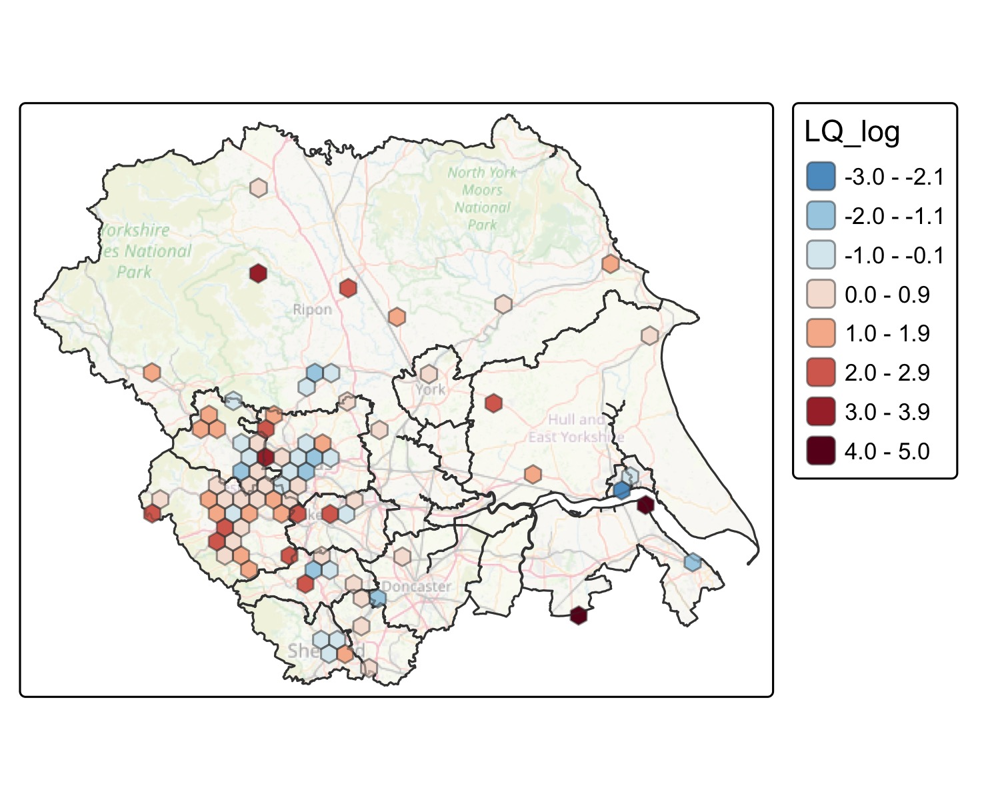{width="700px"}


## Manufacture of basic and fabricated metal products

### LQ gva/job plots


```{r, fig-Manufactureofbasicandfabricatedmetalproducts}
#| fig-width: 8
#| fig-height: 15

p = ynh_autoplots("Manufacture of basic and fabricated metal products")


# Text for adding to qgm document to plot the three combined plots
if(!is.null(p[[3]])){
  
  plottosave = p[[1]] / p[[2]] / p[[3]] + patchwork::plot_layout(heights = c(3, 12, 12))
  
} else {
  
  plottosave = p[[1]] / p[[2]] + patchwork::plot_layout(heights = c(3, 12))
  
}

plottosave


```


### Map: within-Y&H micro-LQ for 2024/25


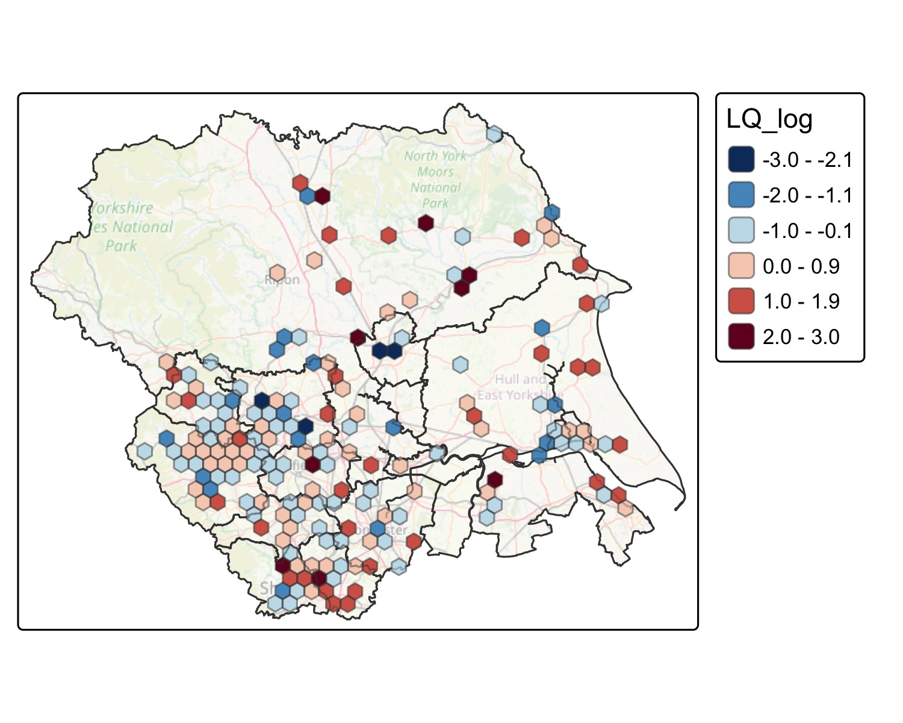{width="700px"}


## Manufacture of wood and paper products and printing

### LQ gva/job plots


```{r, fig-Manufactureofwoodandpaperproductsandprinting}
#| fig-width: 8
#| fig-height: 15

p = ynh_autoplots("Manufacture of wood and paper products and printing")


# Text for adding to qgm document to plot the three combined plots
if(!is.null(p[[3]])){
  
  plottosave = p[[1]] / p[[2]] / p[[3]] + patchwork::plot_layout(heights = c(3, 12, 12))
  
} else {
  
  plottosave = p[[1]] / p[[2]] + patchwork::plot_layout(heights = c(3, 12))
  
}

plottosave


```


### Map: within-Y&H micro-LQ for 2024/25


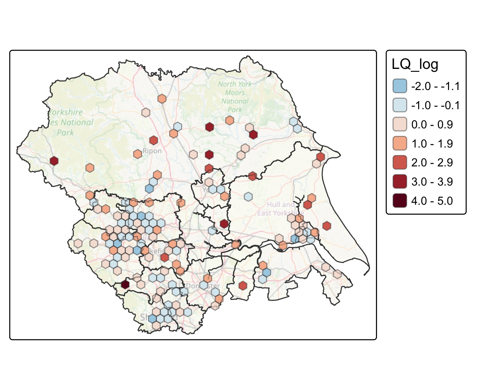{width="700px"}


## Manufacture of petroleum, chemicals and other minerals

### LQ gva/job plots


```{r, fig-Manufactureofpetroleumchemicalsandotherminerals}
#| fig-width: 8
#| fig-height: 15

p = ynh_autoplots("Manufacture of petroleum, chemicals and other minerals")


# Text for adding to qgm document to plot the three combined plots
if(!is.null(p[[3]])){
  
  plottosave = p[[1]] / p[[2]] / p[[3]] + patchwork::plot_layout(heights = c(3, 12, 12))
  
} else {
  
  plottosave = p[[1]] / p[[2]] + patchwork::plot_layout(heights = c(3, 12))
  
}

plottosave


```


### Map: within-Y&H micro-LQ for 2024/25


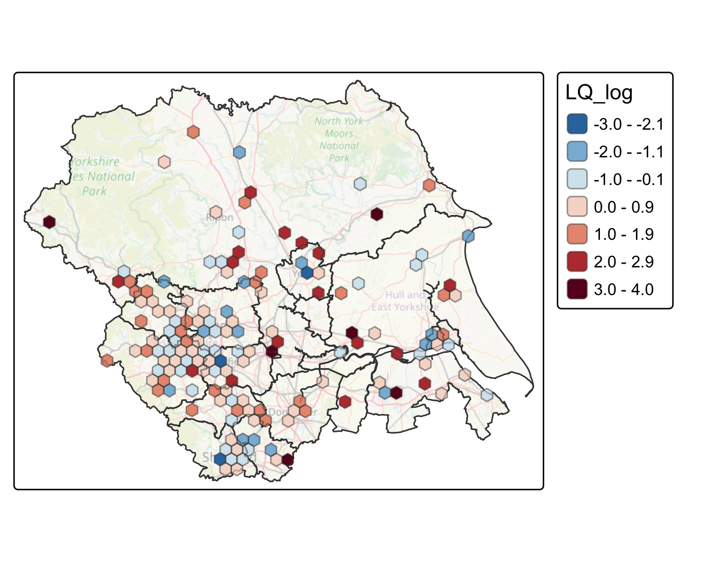{width="700px"}


## Manufacture of food, beverages and tobacco

### LQ gva/job plots


```{r, fig-Manufactureoffoodbeveragesandtobacco}
#| fig-width: 8
#| fig-height: 15

p = ynh_autoplots("Manufacture of food, beverages and tobacco")


# Text for adding to qgm document to plot the three combined plots
if(!is.null(p[[3]])){
  
  plottosave = p[[1]] / p[[2]] / p[[3]] + patchwork::plot_layout(heights = c(3, 12, 12))
  
} else {
  
  plottosave = p[[1]] / p[[2]] + patchwork::plot_layout(heights = c(3, 12))
  
}

plottosave


```


### Map: within-Y&H micro-LQ for 2024/25


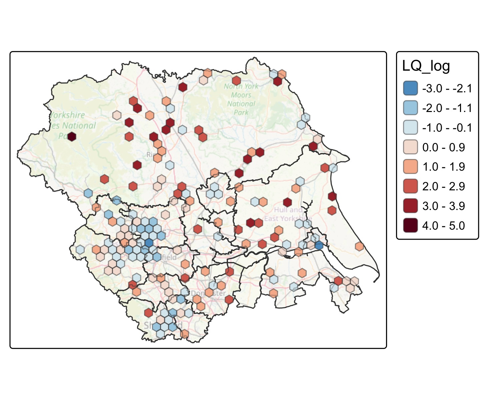{width="700px"}


## Social work activities

### LQ gva/job plots


```{r, fig-Socialworkactivities}
#| fig-width: 8
#| fig-height: 15

p = ynh_autoplots("Social work activities")


# Text for adding to qgm document to plot the three combined plots
if(!is.null(p[[3]])){
  
  plottosave = p[[1]] / p[[2]] / p[[3]] + patchwork::plot_layout(heights = c(3, 12, 12))
  
} else {
  
  plottosave = p[[1]] / p[[2]] + patchwork::plot_layout(heights = c(3, 12))
  
}

plottosave


```


### Map: within-Y&H micro-LQ for 2024/25


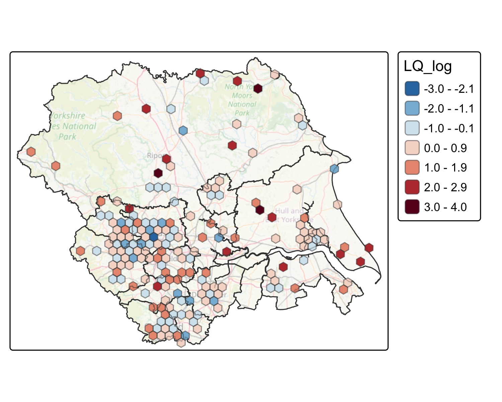{width="700px"}


## Employment activities; tourism and security services

### LQ gva/job plots


```{r, fig-Employmentactivitiestourismandsecurityservices}
#| fig-width: 8
#| fig-height: 15

p = ynh_autoplots("Employment activities; tourism and security services")


# Text for adding to qgm document to plot the three combined plots
if(!is.null(p[[3]])){
  
  plottosave = p[[1]] / p[[2]] / p[[3]] + patchwork::plot_layout(heights = c(3, 12, 12))
  
} else {
  
  plottosave = p[[1]] / p[[2]] + patchwork::plot_layout(heights = c(3, 12))
  
}

plottosave


```


### Map: within-Y&H micro-LQ for 2024/25


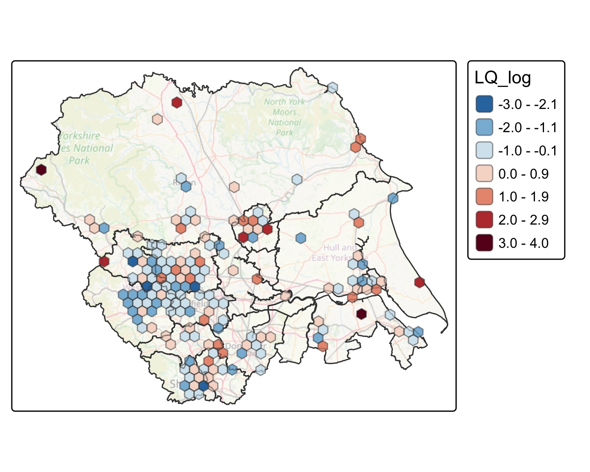{width="700px"}


## Warehousing and transport support activities

### LQ gva/job plots


```{r, fig-Warehousingandtransportsupportactivities}
#| fig-width: 8
#| fig-height: 15

p = ynh_autoplots("Warehousing and transport support activities")


# Text for adding to qgm document to plot the three combined plots
if(!is.null(p[[3]])){
  
  plottosave = p[[1]] / p[[2]] / p[[3]] + patchwork::plot_layout(heights = c(3, 12, 12))
  
} else {
  
  plottosave = p[[1]] / p[[2]] + patchwork::plot_layout(heights = c(3, 12))
  
}

plottosave


```


### Map: within-Y&H micro-LQ for 2024/25


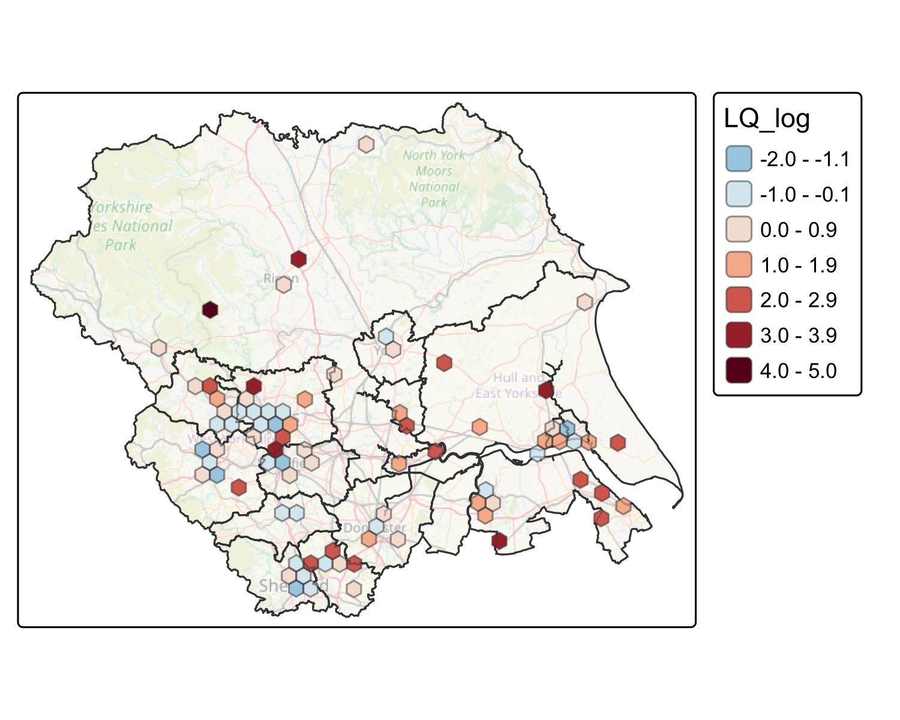{width="700px"}


## Financial and insurance activities

### LQ gva/job plots


```{r, fig-Financialandinsuranceactivities}
#| fig-width: 8
#| fig-height: 15

p = ynh_autoplots("Financial and insurance activities")


# Text for adding to qgm document to plot the three combined plots
if(!is.null(p[[3]])){
  
  plottosave = p[[1]] / p[[2]] / p[[3]] + patchwork::plot_layout(heights = c(3, 12, 12))
  
} else {
  
  plottosave = p[[1]] / p[[2]] + patchwork::plot_layout(heights = c(3, 12))
  
}

plottosave


```


### Map: within-Y&H micro-LQ for 2024/25


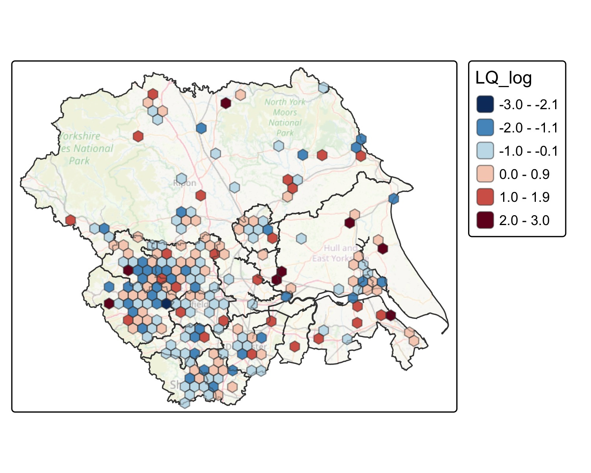{width="700px"}


## Electricity, gas, water; sewerage and waste management

### LQ gva/job plots


```{r, fig-Electricitygaswatersewerageandwastemanagement}
#| fig-width: 8
#| fig-height: 15

p = ynh_autoplots("Electricity, gas, water; sewerage and waste management")


# Text for adding to qgm document to plot the three combined plots
if(!is.null(p[[3]])){
  
  plottosave = p[[1]] / p[[2]] / p[[3]] + patchwork::plot_layout(heights = c(3, 12, 12))
  
} else {
  
  plottosave = p[[1]] / p[[2]] + patchwork::plot_layout(heights = c(3, 12))
  
}

plottosave


```


### Map: within-Y&H micro-LQ for 2024/25


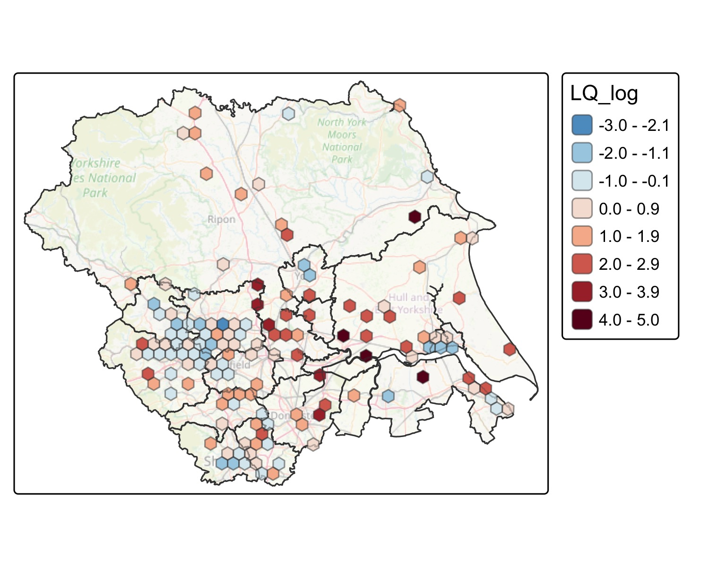{width="700px"}


## Food and beverage service activities

### LQ gva/job plots


```{r, fig-Foodandbeverageserviceactivities}
#| fig-width: 8
#| fig-height: 15

p = ynh_autoplots("Food and beverage service activities")


# Text for adding to qgm document to plot the three combined plots
if(!is.null(p[[3]])){
  
  plottosave = p[[1]] / p[[2]] / p[[3]] + patchwork::plot_layout(heights = c(3, 12, 12))
  
} else {
  
  plottosave = p[[1]] / p[[2]] + patchwork::plot_layout(heights = c(3, 12))
  
}

plottosave


```


### Map: within-Y&H micro-LQ for 2024/25


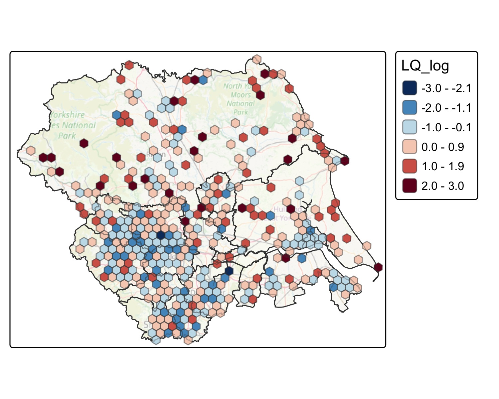{width="700px"}


## Education

### LQ gva/job plots


```{r, fig-Education}
#| fig-width: 8
#| fig-height: 15

p = ynh_autoplots("Education")


# Text for adding to qgm document to plot the three combined plots
if(!is.null(p[[3]])){
  
  plottosave = p[[1]] / p[[2]] / p[[3]] + patchwork::plot_layout(heights = c(3, 12, 12))
  
} else {
  
  plottosave = p[[1]] / p[[2]] + patchwork::plot_layout(heights = c(3, 12))
  
}

plottosave


```


### Map: within-Y&H micro-LQ for 2024/25


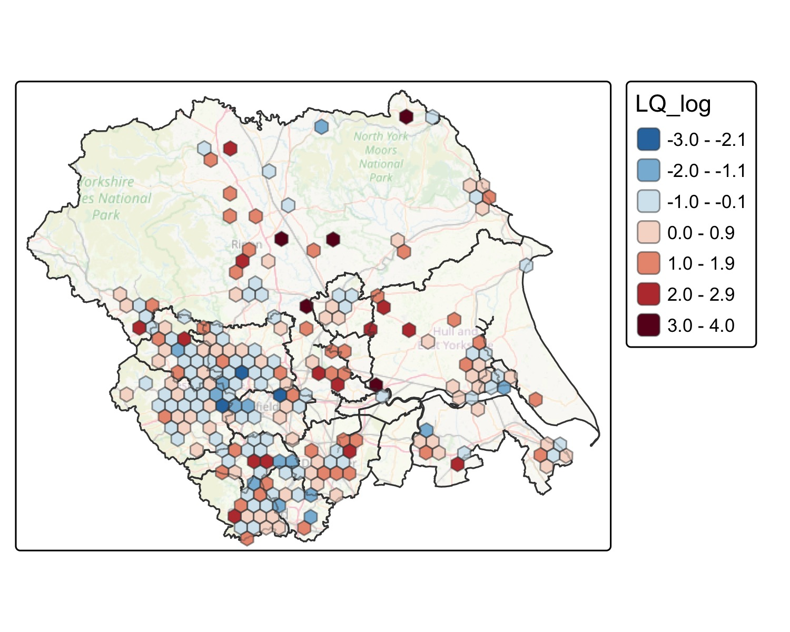{width="700px"}


## Office administration and business support activities

### LQ gva/job plots


```{r, fig-Officeadministrationandbusinesssupportactivities}
#| fig-width: 8
#| fig-height: 15

p = ynh_autoplots("Office administration and business support activities")


# Text for adding to qgm document to plot the three combined plots
if(!is.null(p[[3]])){
  
  plottosave = p[[1]] / p[[2]] / p[[3]] + patchwork::plot_layout(heights = c(3, 12, 12))
  
} else {
  
  plottosave = p[[1]] / p[[2]] + patchwork::plot_layout(heights = c(3, 12))
  
}

plottosave


```


### Map: within-Y&H micro-LQ for 2024/25


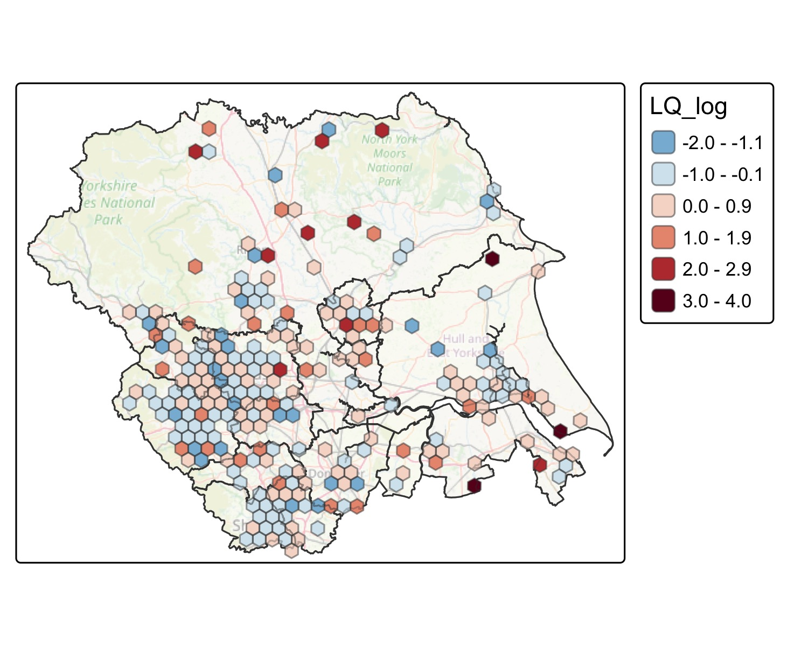{width="700px"}


## Land, water and air transport

### LQ gva/job plots


```{r, fig-Landwaterandairtransport}
#| fig-width: 8
#| fig-height: 15

p = ynh_autoplots("Land, water and air transport")


# Text for adding to qgm document to plot the three combined plots
if(!is.null(p[[3]])){
  
  plottosave = p[[1]] / p[[2]] / p[[3]] + patchwork::plot_layout(heights = c(3, 12, 12))
  
} else {
  
  plottosave = p[[1]] / p[[2]] + patchwork::plot_layout(heights = c(3, 12))
  
}

plottosave


```


### Map: within-Y&H micro-LQ for 2024/25


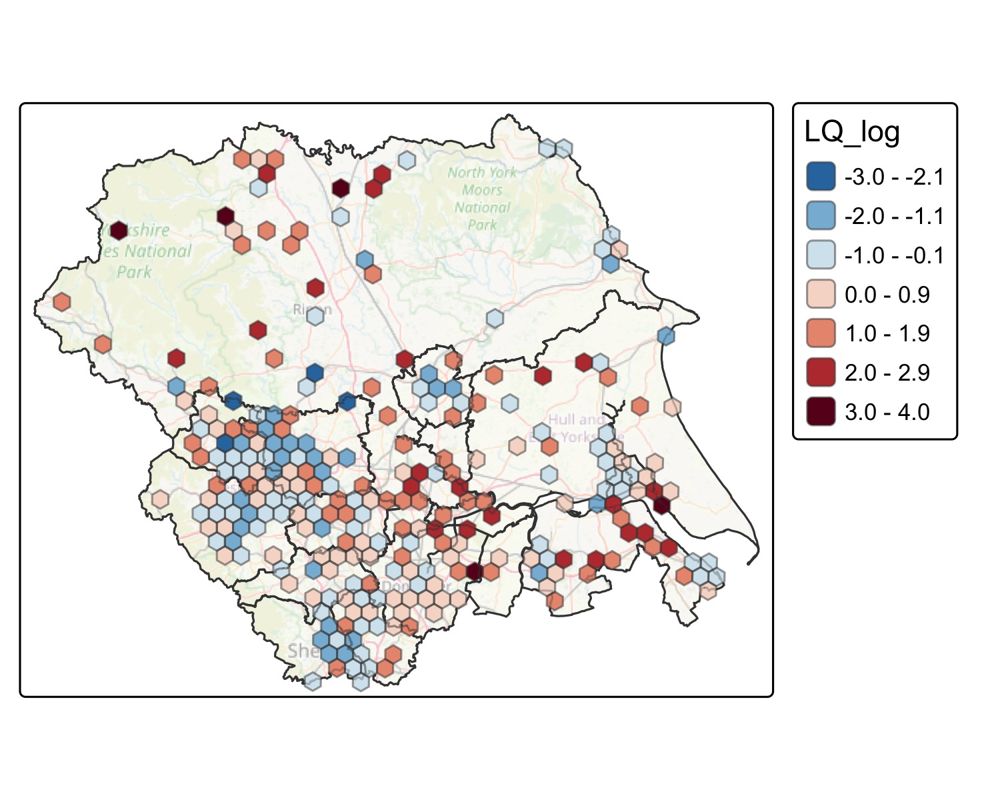{width="700px"}


## Residential care activities

### LQ gva/job plots


```{r, fig-Residentialcareactivities}
#| fig-width: 8
#| fig-height: 15

p = ynh_autoplots("Residential care activities")


# Text for adding to qgm document to plot the three combined plots
if(!is.null(p[[3]])){
  
  plottosave = p[[1]] / p[[2]] / p[[3]] + patchwork::plot_layout(heights = c(3, 12, 12))
  
} else {
  
  plottosave = p[[1]] / p[[2]] + patchwork::plot_layout(heights = c(3, 12))
  
}

plottosave


```


### Map: within-Y&H micro-LQ for 2024/25


{width="700px"}


## Real estate activities, excluding imputed rental

### LQ gva/job plots


```{r, fig-Realestateactivitiesexcludingimputedrental}
#| fig-width: 8
#| fig-height: 15

p = ynh_autoplots("Real estate activities, excluding imputed rental")


# Text for adding to qgm document to plot the three combined plots
if(!is.null(p[[3]])){
  
  plottosave = p[[1]] / p[[2]] / p[[3]] + patchwork::plot_layout(heights = c(3, 12, 12))
  
} else {
  
  plottosave = p[[1]] / p[[2]] + patchwork::plot_layout(heights = c(3, 12))
  
}

plottosave


```


### Map: within-Y&H micro-LQ for 2024/25


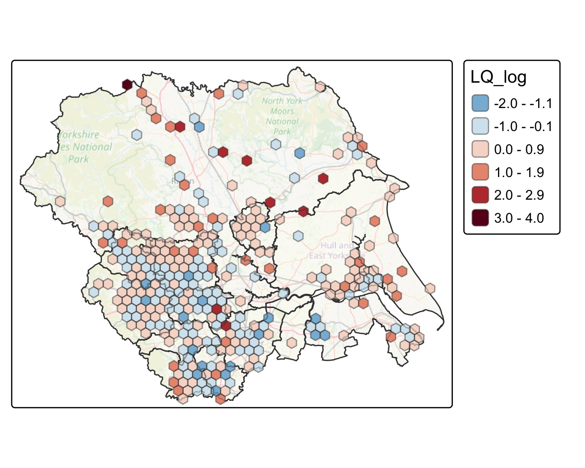{width="700px"}


## Human health activities

### LQ gva/job plots


```{r, fig-Humanhealthactivities}
#| fig-width: 8
#| fig-height: 15

p = ynh_autoplots("Human health activities")


# Text for adding to qgm document to plot the three combined plots
if(!is.null(p[[3]])){
  
  plottosave = p[[1]] / p[[2]] / p[[3]] + patchwork::plot_layout(heights = c(3, 12, 12))
  
} else {
  
  plottosave = p[[1]] / p[[2]] + patchwork::plot_layout(heights = c(3, 12))
  
}

plottosave


```


### Map: within-Y&H micro-LQ for 2024/25


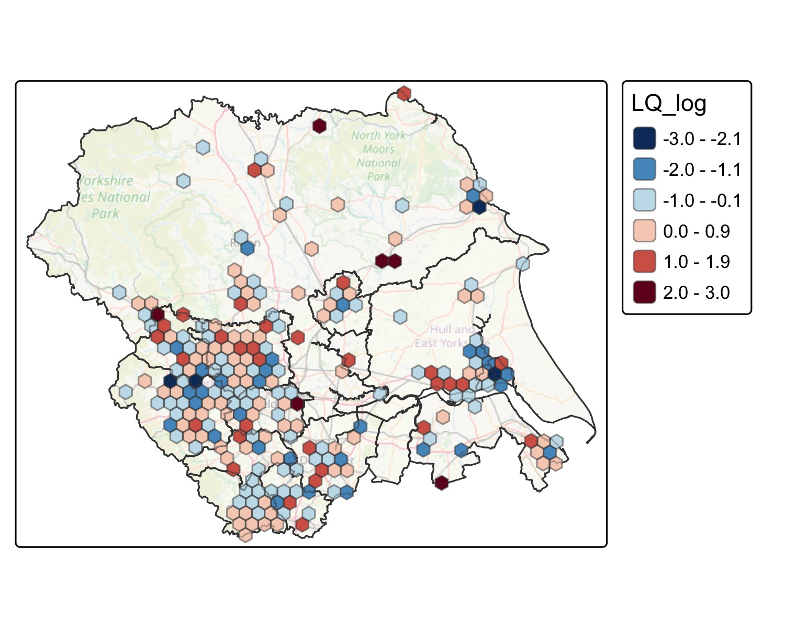{width="700px"}


## Wholesale trade

### LQ gva/job plots


```{r, fig-Wholesaletrade}
#| fig-width: 8
#| fig-height: 15

p = ynh_autoplots("Wholesale trade")


# Text for adding to qgm document to plot the three combined plots
if(!is.null(p[[3]])){
  
  plottosave = p[[1]] / p[[2]] / p[[3]] + patchwork::plot_layout(heights = c(3, 12, 12))
  
} else {
  
  plottosave = p[[1]] / p[[2]] + patchwork::plot_layout(heights = c(3, 12))
  
}

plottosave


```


### Map: within-Y&H micro-LQ for 2024/25


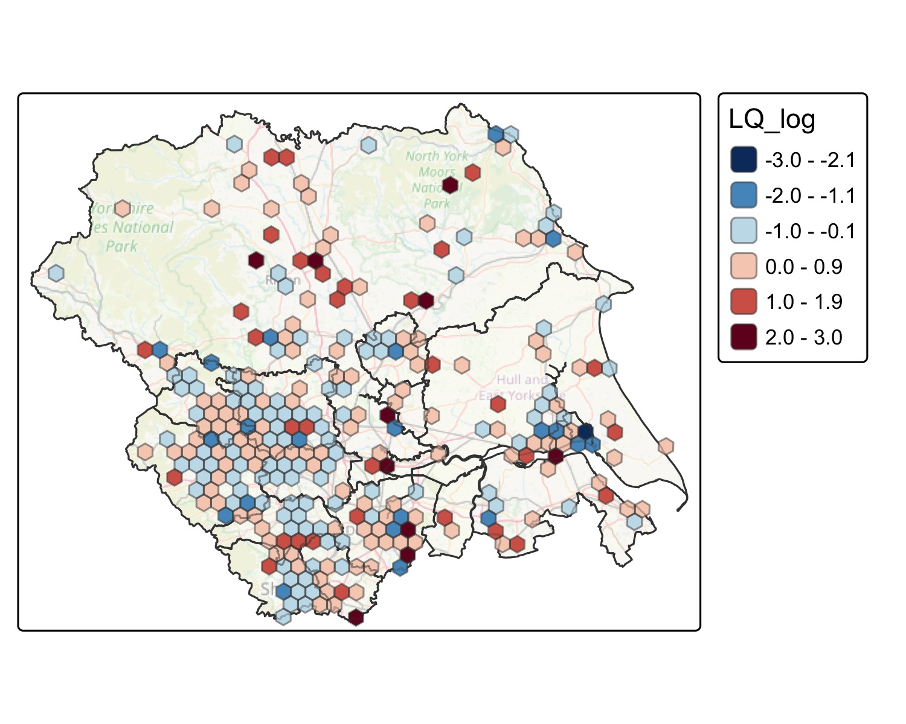{width="700px"}


## Construction of buildings

### LQ gva/job plots


```{r, fig-Constructionofbuildings}
#| fig-width: 8
#| fig-height: 15

p = ynh_autoplots("Construction of buildings")


# Text for adding to qgm document to plot the three combined plots
if(!is.null(p[[3]])){
  
  plottosave = p[[1]] / p[[2]] / p[[3]] + patchwork::plot_layout(heights = c(3, 12, 12))
  
} else {
  
  plottosave = p[[1]] / p[[2]] + patchwork::plot_layout(heights = c(3, 12))
  
}

plottosave


```


### Map: within-Y&H micro-LQ for 2024/25


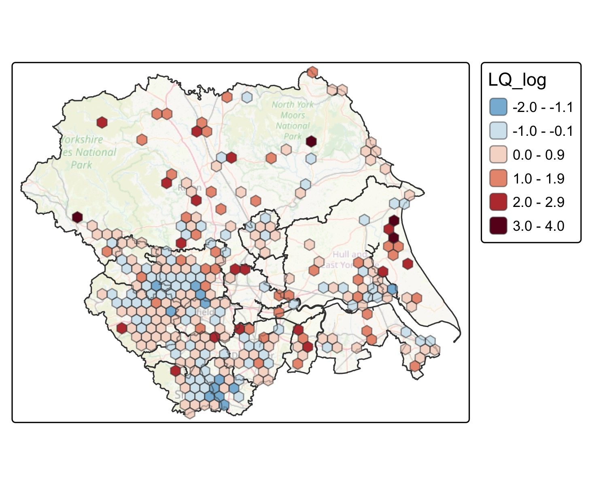{width="700px"}


## Motor trades

### LQ gva/job plots


```{r, fig-Motortrades}
#| fig-width: 8
#| fig-height: 15

p = ynh_autoplots("Motor trades")


# Text for adding to qgm document to plot the three combined plots
if(!is.null(p[[3]])){
  
  plottosave = p[[1]] / p[[2]] / p[[3]] + patchwork::plot_layout(heights = c(3, 12, 12))
  
} else {
  
  plottosave = p[[1]] / p[[2]] + patchwork::plot_layout(heights = c(3, 12))
  
}

plottosave


```


### Map: within-Y&H micro-LQ for 2024/25


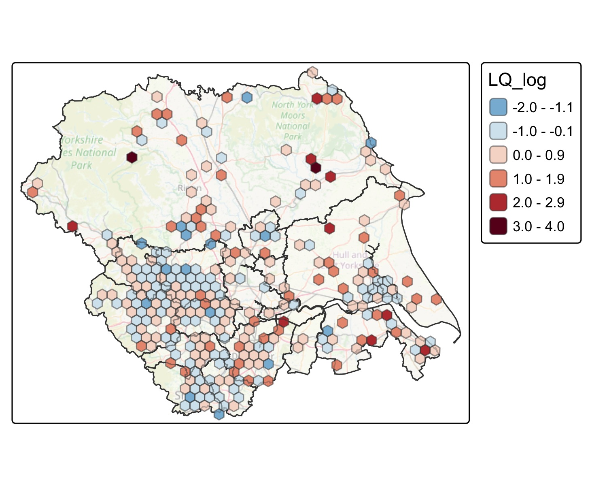{width="700px"}


## Retail trade

### LQ gva/job plots


```{r, fig-Retailtrade}
#| fig-width: 8
#| fig-height: 15

p = ynh_autoplots("Retail trade")


# Text for adding to qgm document to plot the three combined plots
if(!is.null(p[[3]])){
  
  plottosave = p[[1]] / p[[2]] / p[[3]] + patchwork::plot_layout(heights = c(3, 12, 12))
  
} else {
  
  plottosave = p[[1]] / p[[2]] + patchwork::plot_layout(heights = c(3, 12))
  
}

plottosave


```


### Map: within-Y&H micro-LQ for 2024/25


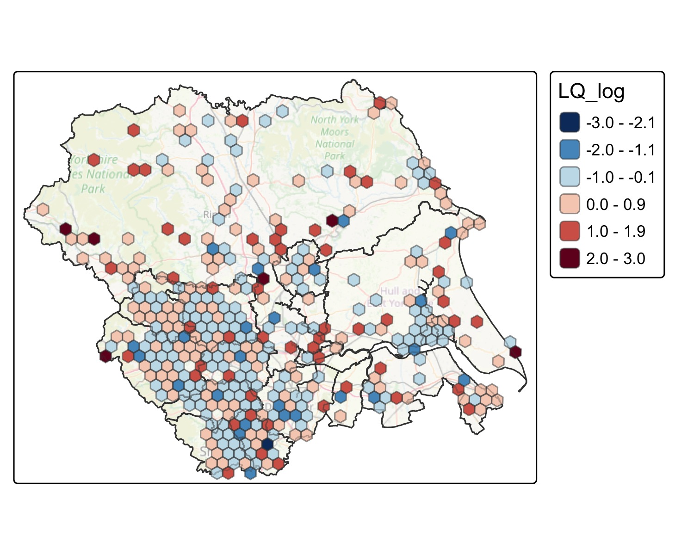{width="700px"}


## Legal and accounting activities

### LQ gva/job plots


```{r, fig-Legalandaccountingactivities}
#| fig-width: 8
#| fig-height: 15

p = ynh_autoplots("Legal and accounting activities")


# Text for adding to qgm document to plot the three combined plots
if(!is.null(p[[3]])){
  
  plottosave = p[[1]] / p[[2]] / p[[3]] + patchwork::plot_layout(heights = c(3, 12, 12))
  
} else {
  
  plottosave = p[[1]] / p[[2]] + patchwork::plot_layout(heights = c(3, 12))
  
}

plottosave


```


### Map: within-Y&H micro-LQ for 2024/25


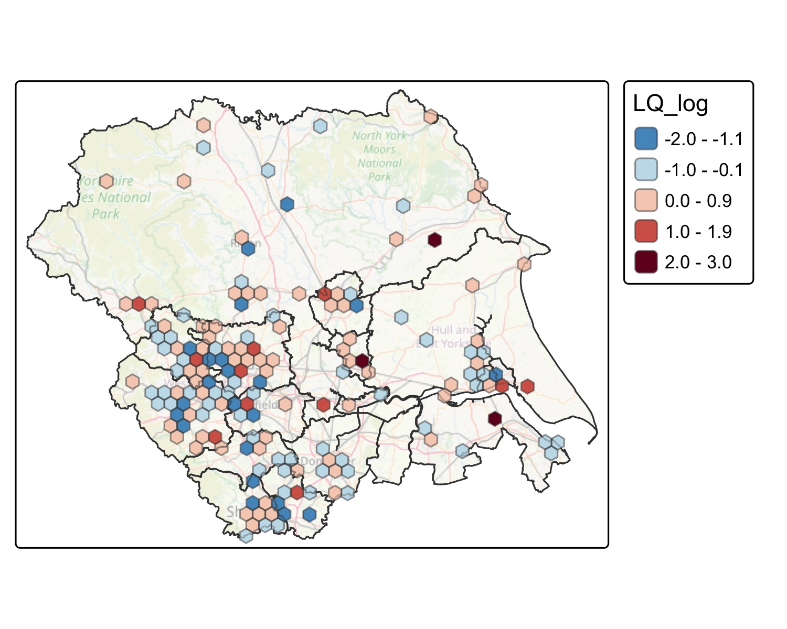{width="700px"}


## Gambling and betting; sports and recreation activities

### LQ gva/job plots


```{r, fig-Gamblingandbettingsportsandrecreationactivities}
#| fig-width: 8
#| fig-height: 15

p = ynh_autoplots("Gambling and betting; sports and recreation activities")


# Text for adding to qgm document to plot the three combined plots
if(!is.null(p[[3]])){
  
  plottosave = p[[1]] / p[[2]] / p[[3]] + patchwork::plot_layout(heights = c(3, 12, 12))
  
} else {
  
  plottosave = p[[1]] / p[[2]] + patchwork::plot_layout(heights = c(3, 12))
  
}

plottosave


```


### Map: within-Y&H micro-LQ for 2024/25


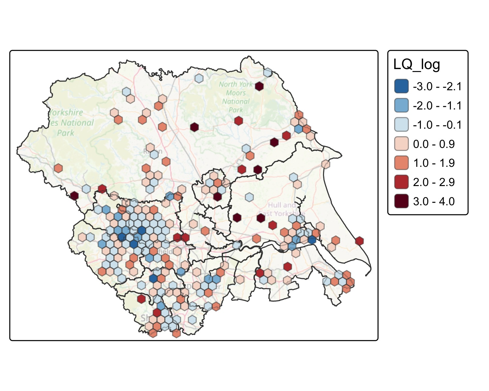{width="700px"}


## Specialised construction activities

### LQ gva/job plots


```{r, fig-Specialisedconstructionactivities}
#| fig-width: 8
#| fig-height: 15

p = ynh_autoplots("Specialised construction activities")


# Text for adding to qgm document to plot the three combined plots
if(!is.null(p[[3]])){
  
  plottosave = p[[1]] / p[[2]] / p[[3]] + patchwork::plot_layout(heights = c(3, 12, 12))
  
} else {
  
  plottosave = p[[1]] / p[[2]] + patchwork::plot_layout(heights = c(3, 12))
  
}

plottosave


```


### Map: within-Y&H micro-LQ for 2024/25


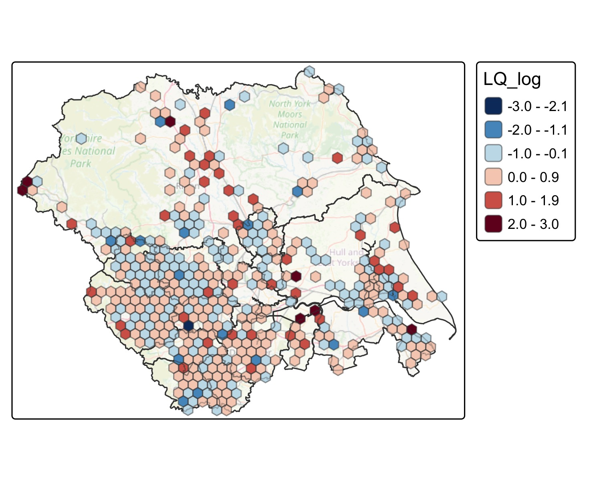{width="700px"}


## Public administration and defence

### LQ gva/job plots


```{r, fig-Publicadministrationanddefence}
#| fig-width: 8
#| fig-height: 15

p = ynh_autoplots("Public administration and defence")


# Text for adding to qgm document to plot the three combined plots
if(!is.null(p[[3]])){
  
  plottosave = p[[1]] / p[[2]] / p[[3]] + patchwork::plot_layout(heights = c(3, 12, 12))
  
} else {
  
  plottosave = p[[1]] / p[[2]] + patchwork::plot_layout(heights = c(3, 12))
  
}

plottosave


```


### Map: within-Y&H micro-LQ for 2024/25


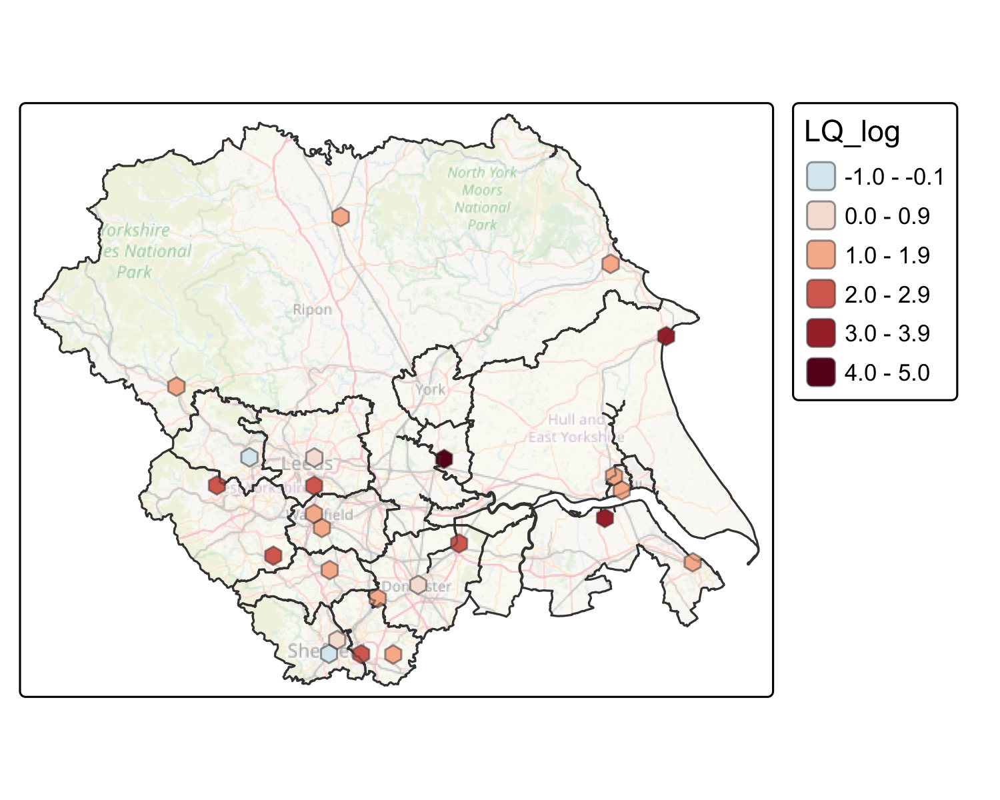{width="700px"}


## Other professional, scientific and technical activities

### LQ gva/job plots


```{r, fig-Otherprofessionalscientificandtechnicalactivities}
#| fig-width: 8
#| fig-height: 15

p = ynh_autoplots("Other professional, scientific and technical activities")


# Text for adding to qgm document to plot the three combined plots
if(!is.null(p[[3]])){
  
  plottosave = p[[1]] / p[[2]] / p[[3]] + patchwork::plot_layout(heights = c(3, 12, 12))
  
} else {
  
  plottosave = p[[1]] / p[[2]] + patchwork::plot_layout(heights = c(3, 12))
  
}

plottosave


```


### Map: within-Y&H micro-LQ for 2024/25


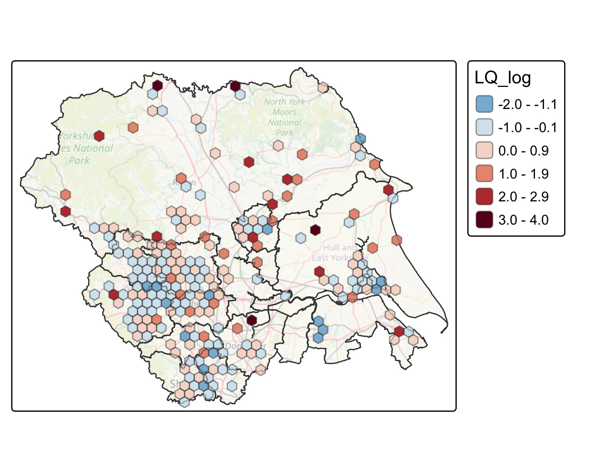{width="700px"}


## Head offices and management consultancy

### LQ gva/job plots


```{r, fig-Headofficesandmanagementconsultancy}
#| fig-width: 8
#| fig-height: 15

p = ynh_autoplots("Head offices and management consultancy")


# Text for adding to qgm document to plot the three combined plots
if(!is.null(p[[3]])){
  
  plottosave = p[[1]] / p[[2]] / p[[3]] + patchwork::plot_layout(heights = c(3, 12, 12))
  
} else {
  
  plottosave = p[[1]] / p[[2]] + patchwork::plot_layout(heights = c(3, 12))
  
}

plottosave


```


### Map: within-Y&H micro-LQ for 2024/25


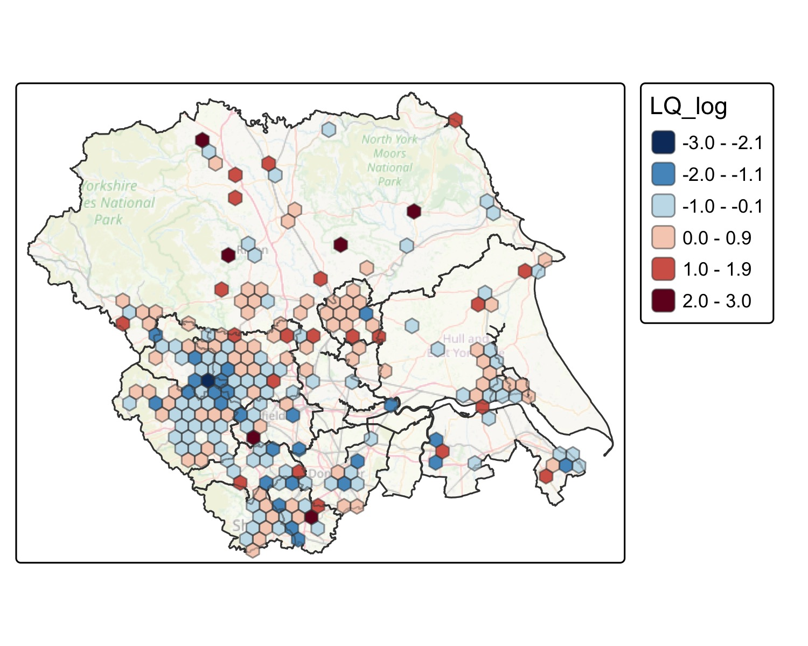{width="700px"}


## Postal and courier activities

### LQ gva/job plots


```{r, fig-Postalandcourieractivities}
#| fig-width: 8
#| fig-height: 15

p = ynh_autoplots("Postal and courier activities")


# Text for adding to qgm document to plot the three combined plots
if(!is.null(p[[3]])){
  
  plottosave = p[[1]] / p[[2]] / p[[3]] + patchwork::plot_layout(heights = c(3, 12, 12))
  
} else {
  
  plottosave = p[[1]] / p[[2]] + patchwork::plot_layout(heights = c(3, 12))
  
}

plottosave


```


### Map: within-Y&H micro-LQ for 2024/25


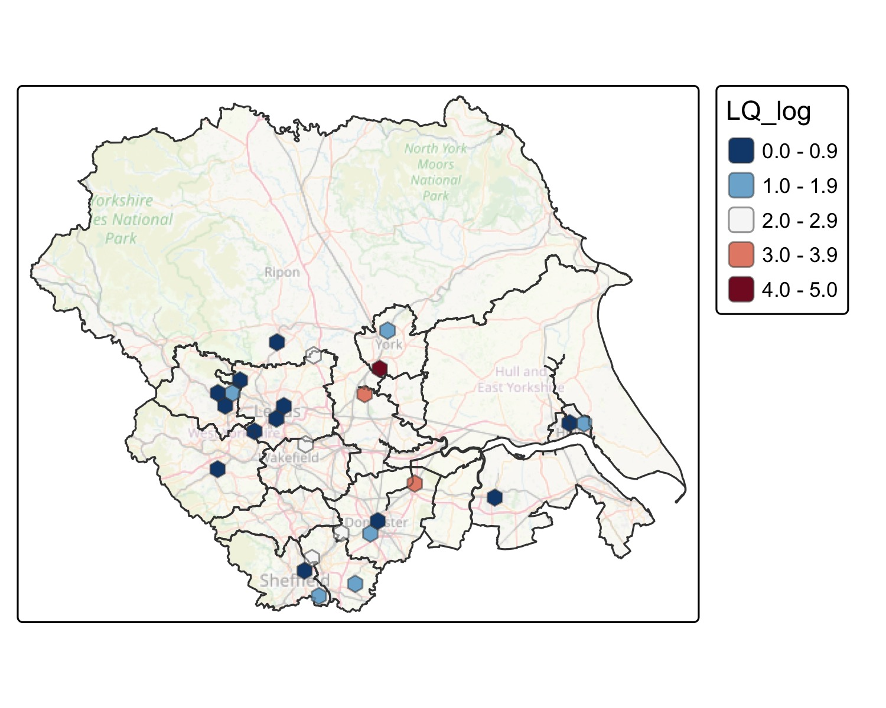{width="700px"}


## Rental and leasing activities

### LQ gva/job plots


```{r, fig-Rentalandleasingactivities}
#| fig-width: 8
#| fig-height: 15

p = ynh_autoplots("Rental and leasing activities")


# Text for adding to qgm document to plot the three combined plots
if(!is.null(p[[3]])){
  
  plottosave = p[[1]] / p[[2]] / p[[3]] + patchwork::plot_layout(heights = c(3, 12, 12))
  
} else {
  
  plottosave = p[[1]] / p[[2]] + patchwork::plot_layout(heights = c(3, 12))
  
}

plottosave


```


### Map: within-Y&H micro-LQ for 2024/25


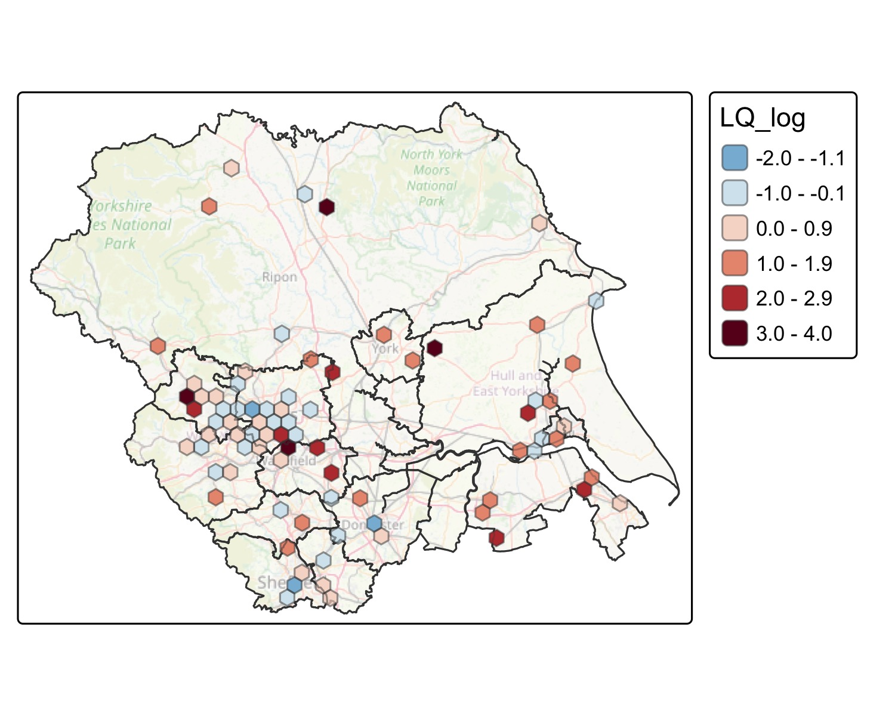{width="700px"}


## Repair and installation of machinery and equipment

### LQ gva/job plots


```{r, fig-Repairandinstallationofmachineryandequipment}
#| fig-width: 8
#| fig-height: 15

p = ynh_autoplots("Repair and installation of machinery and equipment")


# Text for adding to qgm document to plot the three combined plots
if(!is.null(p[[3]])){
  
  plottosave = p[[1]] / p[[2]] / p[[3]] + patchwork::plot_layout(heights = c(3, 12, 12))
  
} else {
  
  plottosave = p[[1]] / p[[2]] + patchwork::plot_layout(heights = c(3, 12))
  
}

plottosave


```


### Map: within-Y&H micro-LQ for 2024/25


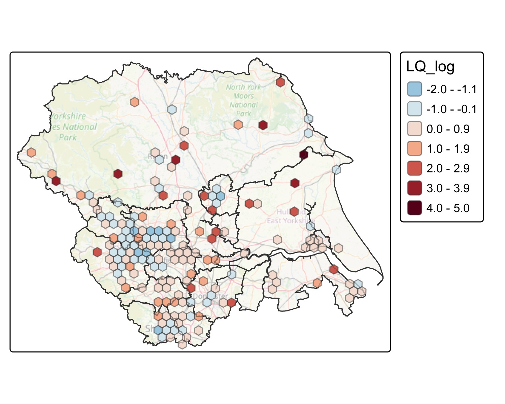{width="700px"}


## Telecommunications; information technology

### LQ gva/job plots


```{r, fig-Telecommunicationsinformationtechnology}
#| fig-width: 8
#| fig-height: 15

p = ynh_autoplots("Telecommunications; information technology")


# Text for adding to qgm document to plot the three combined plots
if(!is.null(p[[3]])){
  
  plottosave = p[[1]] / p[[2]] / p[[3]] + patchwork::plot_layout(heights = c(3, 12, 12))
  
} else {
  
  plottosave = p[[1]] / p[[2]] + patchwork::plot_layout(heights = c(3, 12))
  
}

plottosave


```


### Map: within-Y&H micro-LQ for 2024/25


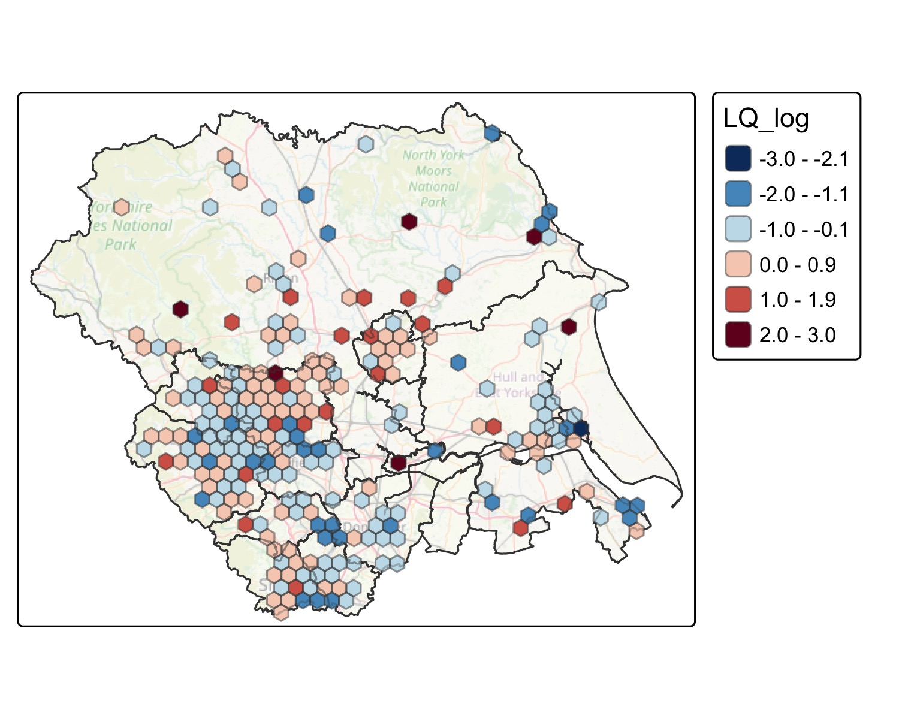{width="700px"}


## Civil engineering

### LQ gva/job plots


```{r, fig-Civilengineering}
#| fig-width: 8
#| fig-height: 15

p = ynh_autoplots("Civil engineering")


# Text for adding to qgm document to plot the three combined plots
if(!is.null(p[[3]])){
  
  plottosave = p[[1]] / p[[2]] / p[[3]] + patchwork::plot_layout(heights = c(3, 12, 12))
  
} else {
  
  plottosave = p[[1]] / p[[2]] + patchwork::plot_layout(heights = c(3, 12))
  
}

plottosave


```


### Map: within-Y&H micro-LQ for 2024/25


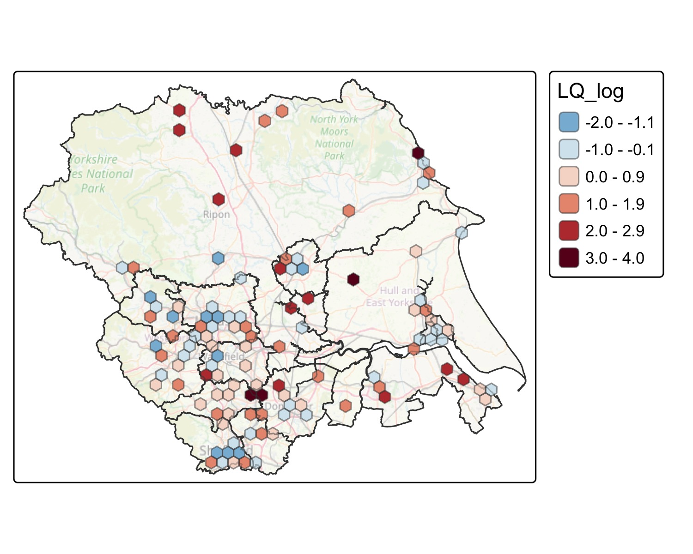{width="700px"}


## Agriculture, forestry and fishing; mining and quarrying

### LQ gva/job plots


```{r, fig-Agricultureforestryandfishingminingandquarrying}
#| fig-width: 8
#| fig-height: 15

p = ynh_autoplots("Agriculture, forestry and fishing; mining and quarrying")


# Text for adding to qgm document to plot the three combined plots
if(!is.null(p[[3]])){
  
  plottosave = p[[1]] / p[[2]] / p[[3]] + patchwork::plot_layout(heights = c(3, 12, 12))
  
} else {
  
  plottosave = p[[1]] / p[[2]] + patchwork::plot_layout(heights = c(3, 12))
  
}

plottosave


```


### Map: within-Y&H micro-LQ for 2024/25


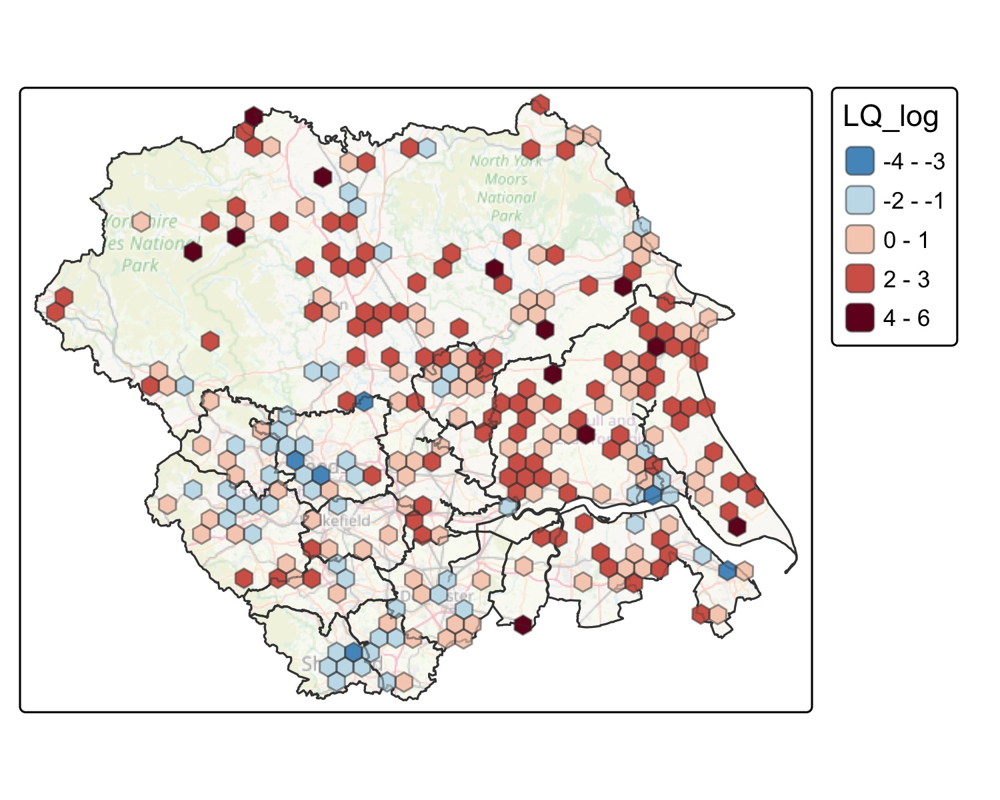{width="700px"}


## Services to buildings and landscape activities

### LQ gva/job plots


```{r, fig-Servicestobuildingsandlandscapeactivities}
#| fig-width: 8
#| fig-height: 15

p = ynh_autoplots("Services to buildings and landscape activities")


# Text for adding to qgm document to plot the three combined plots
if(!is.null(p[[3]])){
  
  plottosave = p[[1]] / p[[2]] / p[[3]] + patchwork::plot_layout(heights = c(3, 12, 12))
  
} else {
  
  plottosave = p[[1]] / p[[2]] + patchwork::plot_layout(heights = c(3, 12))
  
}

plottosave


```


### Map: within-Y&H micro-LQ for 2024/25


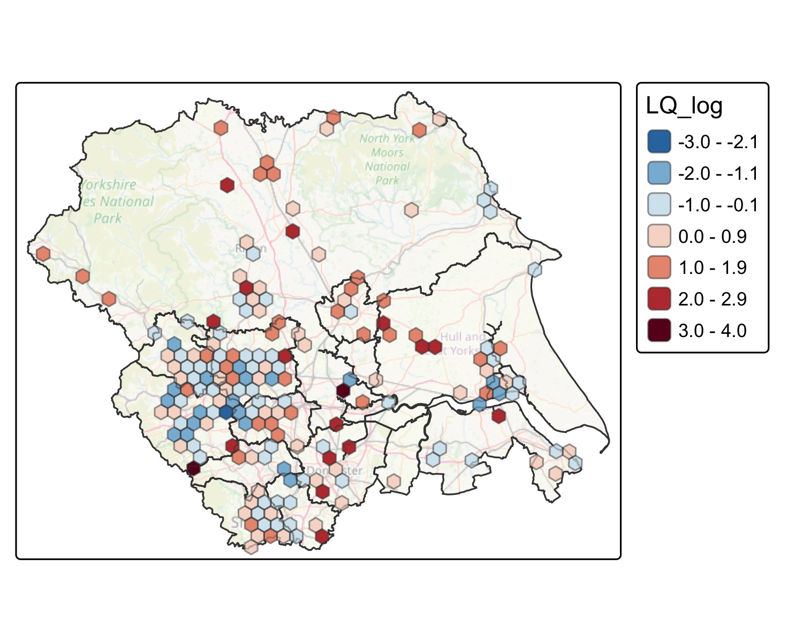{width="700px"}


## Architectural and engineering activities

### LQ gva/job plots


```{r, fig-Architecturalandengineeringactivities}
#| fig-width: 8
#| fig-height: 15

p = ynh_autoplots("Architectural and engineering activities")


# Text for adding to qgm document to plot the three combined plots
if(!is.null(p[[3]])){
  
  plottosave = p[[1]] / p[[2]] / p[[3]] + patchwork::plot_layout(heights = c(3, 12, 12))
  
} else {
  
  plottosave = p[[1]] / p[[2]] + patchwork::plot_layout(heights = c(3, 12))
  
}

plottosave


```


### Map: within-Y&H micro-LQ for 2024/25


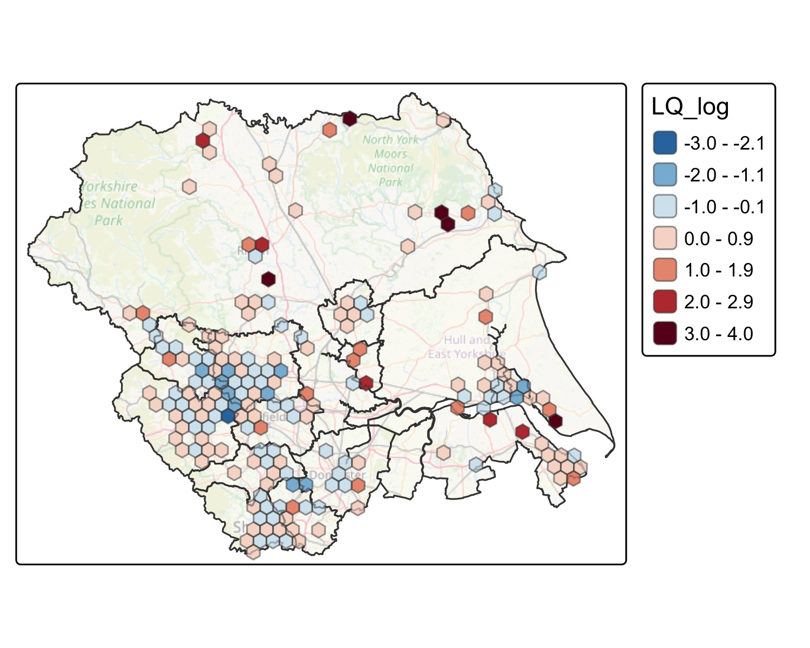{width="700px"}


## Accommodation

### LQ gva/job plots


```{r, fig-Accommodation}
#| fig-width: 8
#| fig-height: 15

p = ynh_autoplots("Accommodation")


# Text for adding to qgm document to plot the three combined plots
if(!is.null(p[[3]])){
  
  plottosave = p[[1]] / p[[2]] / p[[3]] + patchwork::plot_layout(heights = c(3, 12, 12))
  
} else {
  
  plottosave = p[[1]] / p[[2]] + patchwork::plot_layout(heights = c(3, 12))
  
}

plottosave


```


### Map: within-Y&H micro-LQ for 2024/25


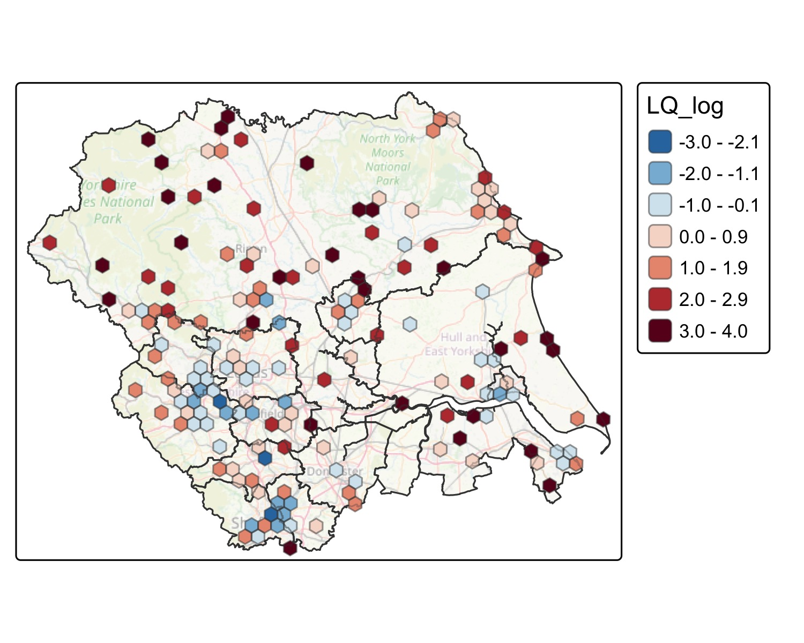{width="700px"}


## Research and development; advertising and market research

### LQ gva/job plots


```{r, fig-Researchanddevelopmentadvertisingandmarketresearch}
#| fig-width: 8
#| fig-height: 15

p = ynh_autoplots("Research and development; advertising and market research")


# Text for adding to qgm document to plot the three combined plots
if(!is.null(p[[3]])){
  
  plottosave = p[[1]] / p[[2]] / p[[3]] + patchwork::plot_layout(heights = c(3, 12, 12))
  
} else {
  
  plottosave = p[[1]] / p[[2]] + patchwork::plot_layout(heights = c(3, 12))
  
}

plottosave


```


### Map: within-Y&H micro-LQ for 2024/25


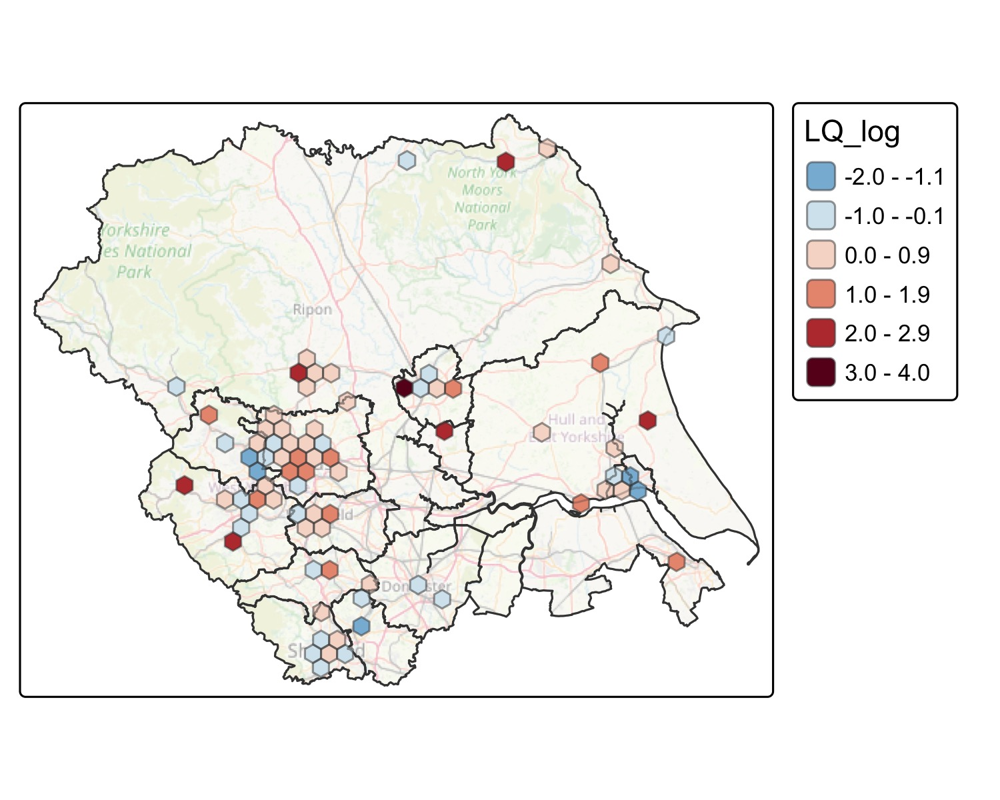{width="700px"}


## Publishing; film and TV production and broadcasting

### LQ gva/job plots


```{r, fig-PublishingfilmandTVproductionandbroadcasting}
#| fig-width: 8
#| fig-height: 15

p = ynh_autoplots("Publishing; film and TV production and broadcasting")


# Text for adding to qgm document to plot the three combined plots
if(!is.null(p[[3]])){
  
  plottosave = p[[1]] / p[[2]] / p[[3]] + patchwork::plot_layout(heights = c(3, 12, 12))
  
} else {
  
  plottosave = p[[1]] / p[[2]] + patchwork::plot_layout(heights = c(3, 12))
  
}

plottosave


```


### Map: within-Y&H micro-LQ for 2024/25


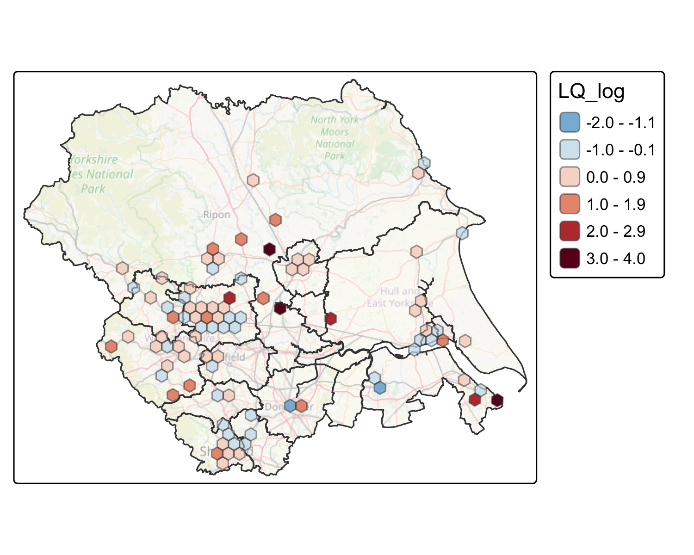{width="700px"}


## Manufacture of machinery and transport equipment

### LQ gva/job plots


```{r, fig-Manufactureofmachineryandtransportequipment}
#| fig-width: 8
#| fig-height: 15

p = ynh_autoplots("Manufacture of machinery and transport equipment")


# Text for adding to qgm document to plot the three combined plots
if(!is.null(p[[3]])){
  
  plottosave = p[[1]] / p[[2]] / p[[3]] + patchwork::plot_layout(heights = c(3, 12, 12))
  
} else {
  
  plottosave = p[[1]] / p[[2]] + patchwork::plot_layout(heights = c(3, 12))
  
}

plottosave


```


### Map: within-Y&H micro-LQ for 2024/25


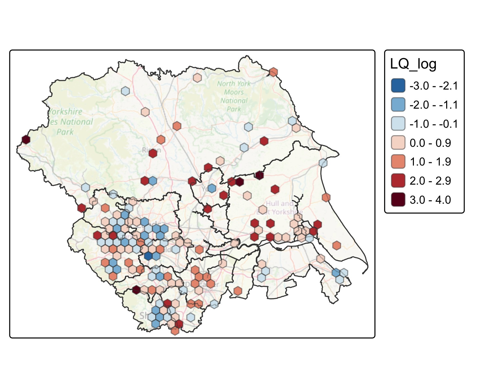{width="700px"}


## Creative, arts, entertainment and cultural activities

### LQ gva/job plots


```{r, fig-Creativeartsentertainmentandculturalactivities}
#| fig-width: 8
#| fig-height: 15

p = ynh_autoplots("Creative, arts, entertainment and cultural activities")


# Text for adding to qgm document to plot the three combined plots
if(!is.null(p[[3]])){
  
  plottosave = p[[1]] / p[[2]] / p[[3]] + patchwork::plot_layout(heights = c(3, 12, 12))
  
} else {
  
  plottosave = p[[1]] / p[[2]] + patchwork::plot_layout(heights = c(3, 12))
  
}

plottosave


```


### Map: within-Y&H micro-LQ for 2024/25


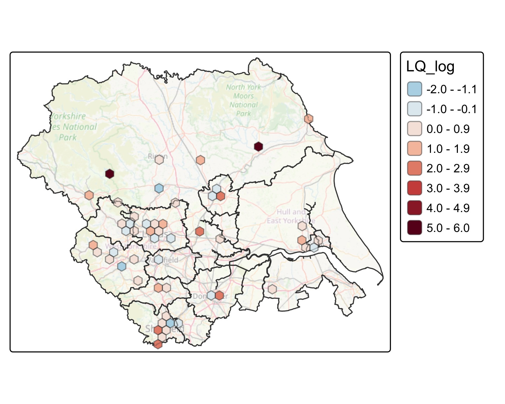{width="700px"}


## Repair of computers, personal and household goods

### LQ gva/job plots


```{r, fig-Repairofcomputerspersonalandhouseholdgoods}
#| fig-width: 8
#| fig-height: 15

p = ynh_autoplots("Repair of computers, personal and household goods")


# Text for adding to qgm document to plot the three combined plots
if(!is.null(p[[3]])){
  
  plottosave = p[[1]] / p[[2]] / p[[3]] + patchwork::plot_layout(heights = c(3, 12, 12))
  
} else {
  
  plottosave = p[[1]] / p[[2]] + patchwork::plot_layout(heights = c(3, 12))
  
}

plottosave


```


### Map: within-Y&H micro-LQ for 2024/25


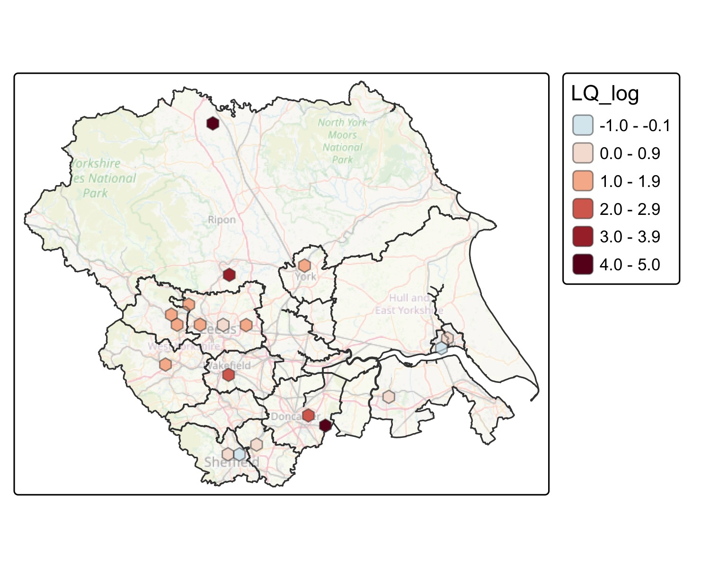{width="700px"}


## Manufacture of electronic, optical and electrical products

### LQ gva/job plots


```{r, fig-Manufactureofelectronicopticalandelectricalproducts}
#| fig-width: 8
#| fig-height: 15

p = ynh_autoplots("Manufacture of electronic, optical and electrical products")


# Text for adding to qgm document to plot the three combined plots
if(!is.null(p[[3]])){
  
  plottosave = p[[1]] / p[[2]] / p[[3]] + patchwork::plot_layout(heights = c(3, 12, 12))
  
} else {
  
  plottosave = p[[1]] / p[[2]] + patchwork::plot_layout(heights = c(3, 12))
  
}

plottosave


```


### Map: within-Y&H micro-LQ for 2024/25


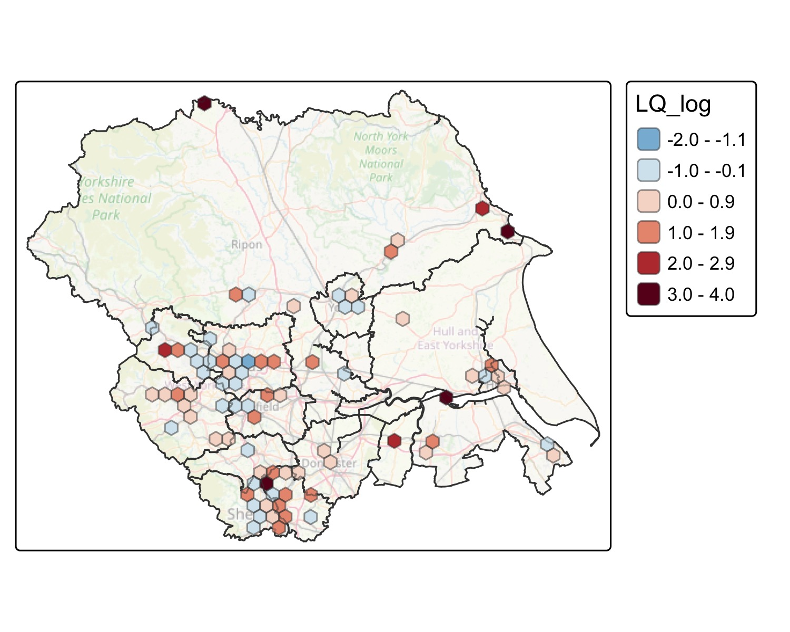{width="700px"}

