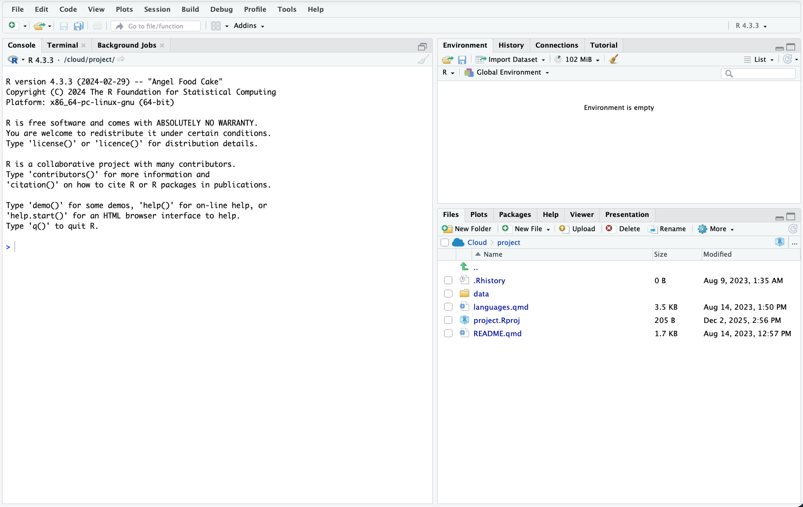
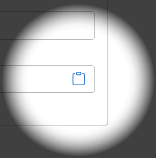
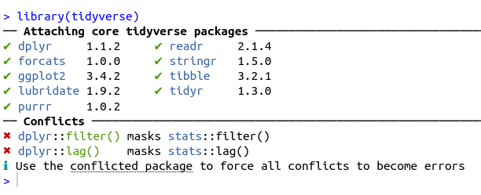

```{r setup, include=FALSE}
knitr::opts_chunk$set(fig.height = 8, fig.width = 10, echo = TRUE, warning = F, error = F, message = F, comment=NA)

```

## These slides run through two things:

1. Getting set up using R and RStudio in [posit.cloud](http://posit.cloud){target="_blank"} through the browser. ([See here](https://danolner.github.io/posts/setting_up_w_r_online/){target="_blank"} if you want a run-through of setting up R on your own machine.)
2. Getting started using RStudio - making a new script, entering some commands and loading a library.


# 1. Get R/RStudio running in your browser with posit.cloud

------------------------------------------------------------------------

:::: {.callout-tip icon="false"}
## Get up and running with RStudio in the cloud

-   [Use this link](https://login.posit.cloud/login){target="_blank"} (or type `bit.ly/positlogin` into the address bar) to create an account at posit.cloud, using the 'don't have an account? Sign up' box. **It'll ask you to check your email for a verification link** so do that before proceeding.
-   Once verified, go back to the posit.cloud tab and log in. You should see a message: "You are logged into Posit. Please select your destination". Choose 'Posit Cloud' (not Posit Connect Cloud). **That'll take you to your online workspace.**
-   Click the **new project** button, top right
-   You can either select '**new project from template**' and then "Data Analysis in R with the tidyverse" to get a tidyverse-ready RStudio. **If you're not sure, choose this one - we'll run through loading the tidyverse below.** 
-   Or choose '**New RStudio project**' if you want to start with a blank slate.

::: center
{width="200px"}
:::
::::


## You should now have RStudio open in your posit.cloud account...

It should look something like the pic below.

::: {.center}

:::


----

## Making a new R script in RStudio

**RStudio is where you'll be doing all the R loveliness**.

Before looking at RStudio in more detail, let's **make a new R script, where you'll do most of your coding**.


::: {.callout-note icon=false}

## Task: Open a new R script in RStudio

* In the **file** menu in RStudio
* Use **new file** and **R script** (note: it tells you the keyboard shortcut for this)

::: {.center}
{width="200px"}
:::

:::

---

After that new file's been made, the script will be open in RStudio, top left (see pic).


# Tour of RStudio and essentials

## 1. The console

The **console** is **bottom left**: all R commands end up being run here. You either **run code directly in the console** or **send code from your R script.**

::: {.callout-note icon=false}

## Task: enter some commands directly into the console

**Click in the console area** so the cursor is on the command line. Type some random sums (or copy, see next slide) - **press enter and you'll see the results directly in the console.**

Note that second one: `sqrt` is a **function** and arguments go into the brackets. More on that in a mo.

```{r}

2+2

sqrt(64)

```

:::

---

::: {.callout-tip}
## Copying code from these slides into RStudio

All code blocks here **have a little clipboard symbol if you hover over them** (see pic) to quickly copy so you can paste it all into RStudio. **Click on the clipboard to copy the text**. This will come in especially handy with larger code blocks later...


```{r}

2+2

sqrt(64)

```

::: {.center}
{width="200px"}
:::


:::


## 2. Giving things names

We can assign all manner of things a **name** to then use them elsewhere: values, strings, lists - **and, crucially, data objects like all the UK's regional GVA.** But these **all use the same method.**

::: {.callout-note icon=false}

## Task: Still in the console, assign a value to a name

```{r}
x = 64
```

You'll see that assignment appear **top right in RStudio**. It can be retrieved just with:

```{r}
x
```

:::


## 3. Using an R script

**We'll now stick some code into that newly created R script we made earlier in the top left of RStudio.** 

All code will run in the console - what we do with scripts is just send our written/saved code *to* the console. 

Let's test this by **adding code to load the tidyverse library**.

::: {.callout-tip}
## What's the tidyverse?

It's a basket of tools that have become part of the R language - they all fit together to make consistent workflows **much** easier.

The online book [R for Data Science](https://r4ds.hadley.nz/) is a great source to learn it, by the person who started it.

:::


---

::: {.callout-note icon=false}

## Task: add a line of code to the R script

Type or paste the following text at the top of the newly opened R script in the top left panel. 

```{r eval = F}
library(tidyverse)
```

When you've put that in, **the script title will go red**, showing it can now be saved (it should look something like the image below).

::: {.center}

:::

* **Save the script** either with the CTRL + S shortcut, or file > save. Give it whatever name you like, but note that it **saves into your self-contained project folder.**

:::


---

::: {.callout-note icon=false}

## Task: Run the `library(tidyverse)` line

**Now we need to actually run that line of code... we can do this in a couple of ways:**

1. In your R script, if **no code text is highlighted/selected** RStudio will **Run the code line by line** (or chunk by chunk - we'll cover that in the taster session).
2. **If a block of text is highlighted**, the whole block will run. So e.g. if you select-all in a script and then run it, **the entire script will run.**

Let's do #1: **Run the code line by line**.

* **To test this, we'll load the tidyverse library with the code we just pasted in** (which is just one line of code at the moment!) Put the cursor at the end of the `libary(tidyverse)` line in the script (if it's not there already), either with the mouse or keyboard. (Keyboard navigation is mostly the same as any other text editor like Word, but [here's a full shortcut list](https://support.posit.co/hc/en-us/articles/200711853-Keyboard-Shortcuts-in-the-RStudio-IDE) if useful.)
* Once there, either use the 'run' button, top right of the script window, or (much easier if you're doing this repeatedly) **press CTRL+ENTER to run it.**

:::


---

**If all is well, you should see the text below in the console - the tidyverse library is now loaded. Huzzah!** 


::: {.center}

:::

---

## That's it

Onto [more R goodness](https://danolner.github.io){target="_blank"}!

Let me know if anything doesn't work or doesn't make sense - d dot olner at sheffield dot ac dot uk


