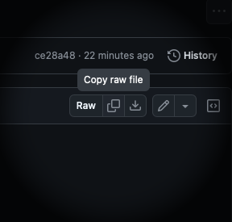
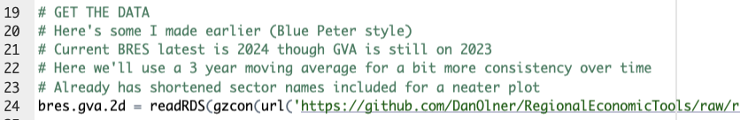
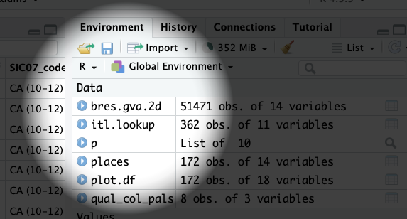
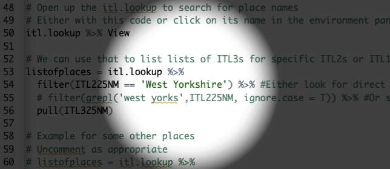
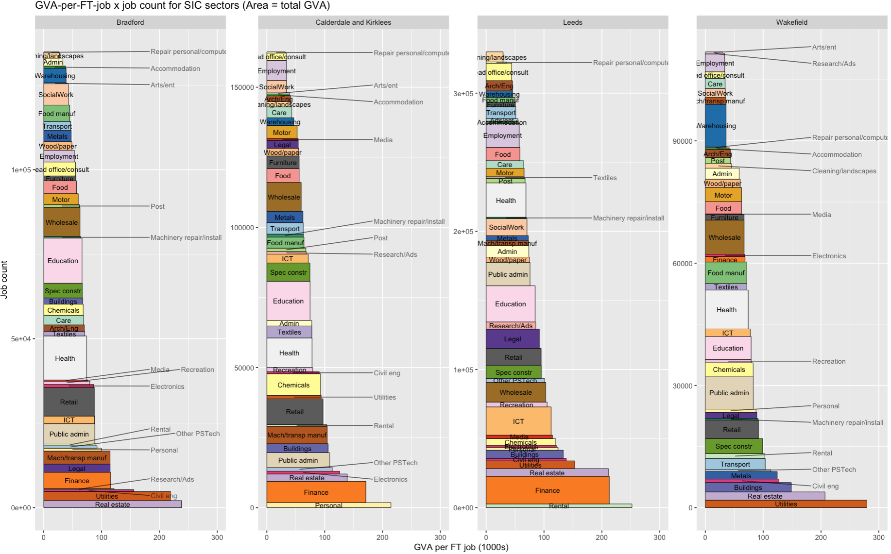

```{r setup, include=FALSE}
knitr::opts_chunk$set(fig.height = 8, fig.width = 10, echo = TRUE, warning = F, error = F, message = F, comment=NA)

```

## These slides run through 3 things:

1.  **Getting set up using R and RStudio in [posit.cloud](http://posit.cloud){target="_blank"} through the browser**. ([See here](https://danolner.github.io/posts/setting_up_w_r_online/){target="_blank"} if you want a run-through of setting up R on your own machine.)
2.  **Getting started using RStudio** - making a new script, entering some commands and loading a library.
3.  An example of **grabbing code from github** to run in RStudio online. The script you'll grab is self-contained: all code and packages are included, and the #codecomments run you through its use. (In this example, we'll make a GVA \* jobs 'block' plot. See comments for details...)

------------------------------------------------------------------------

-   RStudio in posit.cloud is **free for the most basic version** (1GB memory, 25 projects). That's plenty for a lot of stuff. There are paid tiers too, if you want to do heavier things (and avoid all installing-R-on-work-machine pain).
-   With the free version, you get 25 'compute hours' a month (which is calculated in a [mildly confusing way](https://support.posit.co/hc/en-us/articles/4422648539031-Compute-Hours-and-the-Background-Execution-Limit-in-Posit-Cloud#:~:text=The%20article%20will%20explain%20how,allows%20the%20project%20to%20complete.) but should be fine for occasional use).
-   Pricing for more compute power and time is [pretty reasonable](https://posit.cloud/plans), if you end up wanting more.


# 1. Get R/RStudio running in your browser with posit.cloud

------------------------------------------------------------------------

:::: {.callout-tip icon="false"}
## Get up and running with RStudio in the cloud

-   [Use this link](https://login.posit.cloud/login){target="_blank"} (or type `bit.ly/positlogin` into the address bar) to create an account at posit.cloud, using the 'don't have an account? Sign up' box. **It'll ask you to check your email for a verification link** so do that before proceeding.
-   Once verified, go back to the posit.cloud tab and log in. You should see a message: "You are logged into Posit. Please select your destination". Choose 'Posit Cloud' (not Posit Connect Cloud). **That'll take you to your online workspace.**
-   Click the **new project** button, top right
-   You can either select '**new project from template**' and then "Data Analysis in R with the tidyverse" to get a tidyverse-ready RStudio. **If you're not sure, choose this one - we'll run through loading the tidyverse below.**
-   Or choose '**New RStudio project**' if you want to start with a blank slate.

::: center
{width="200px"}
:::
::::

# 2. Using RStudio

------------------------------------------------------------------------

**You should now have RStudio open in your posit.cloud account...**

It should look something like the pic below.

::: center

:::

------------------------------------------------------------------------

## Making a new R script in RStudio

**RStudio is where you'll be doing all the R loveliness**.

Before looking at RStudio in more detail, let's **make a new R script, where you'll do most of your coding**.

:::: {.callout-note icon="false"}
## Task: Open a new R script in RStudio

-   In the **file** menu in RStudio
-   Use **new file** and **R script** (note: it tells you the keyboard shortcut for this)

::: center
{width="200px"}
:::
::::

------------------------------------------------------------------------

After that new file's been made, the script will be open in RStudio, top left (see pic).


# Tour of RStudio and essentials

## 1. The console

The **console** is **bottom left**: all R commands end up being run here. You either **run code directly in the console** or **send code from your R script.**

::: {.callout-note icon="false"}
## Task: enter some commands directly into the console

**Click in the console area** so the cursor is on the command line. Type some random sums (or copy, see next slide) - **press enter and you'll see the results directly in the console.**

Note that second one: `sqrt` is a **function** and arguments go into the brackets. More on that in a mo.

```{r}

2+2

sqrt(64)

```
:::

------------------------------------------------------------------------

:::: callout-tip
## Copying code from these slides into RStudio

All code blocks here **have a little clipboard symbol if you hover over them** (see pic) to quickly copy so you can paste it all into RStudio. **Click on the clipboard to copy the text**. This will come in especially handy with larger code blocks later...

```{r}

2+2

sqrt(64)

```

::: center
{width="200px"}
:::
::::

## 2. Giving things names

We can assign all manner of things a **name** to then use them elsewhere: values, strings, lists - **and, crucially, data objects like all the UK's regional GVA.** But these **all use the same method.**

::: {.callout-note icon="false"}
## Task: Still in the console, assign a value to a name

```{r}
x = 64
```

You'll see that assignment appear **top right in RStudio**. It can be retrieved just with:

```{r}
x
```
:::

## 3. Using an R script

**We'll now stick some code into that newly created R script we made earlier in the top left of RStudio.**

All code will run in the console - what we do with scripts is just send our written/saved code *to* the console.

Let's test this by **adding code to load the tidyverse library**.

::: callout-tip
## What's the tidyverse?

It's a basket of tools that have become part of the R language - they all fit together to make consistent workflows **much** easier.

The online book [R for Data Science](https://r4ds.hadley.nz/) is a great source to learn it, by the person who started it.
:::

------------------------------------------------------------------------

:::: {.callout-note icon="false"}
## Task: add a line of code to the R script

Type or paste the following text at the top of the newly opened R script in the top left panel.

```{r eval = F}
library(tidyverse)
```

When you've put that in, **the script title will go red**, showing it can now be saved (it should look something like the image below).

::: center

:::

-   **Save the script** either with the CTRL + S shortcut, or file \> save. Give it whatever name you like, but note that it **saves into your self-contained project folder.**
::::

------------------------------------------------------------------------

::: {.callout-note icon="false"}
## Task: Run the `library(tidyverse)` line

**Now we need to actually run that line of code... we can do this in a couple of ways:**

1.  In your R script, if **no code text is highlighted/selected** RStudio will **Run the code line by line** (or chunk by chunk - we'll cover that in the taster session).
2.  **If a block of text is highlighted**, the whole block will run. So e.g. if you select-all in a script and then run it, **the entire script will run.**

Let's do #1: **Run the code line by line**.

-   **To test this, we'll load the tidyverse library with the code we just pasted in** (which is just one line of code at the moment!) Put the cursor anywhere on the `libary(tidyverse)` line in the script (if it's not there already), either with the mouse or keyboard. (Keyboard navigation is mostly the same as any other text editor like Word, but [here's a full shortcut list](https://support.posit.co/hc/en-us/articles/200711853-Keyboard-Shortcuts-in-the-RStudio-IDE) if useful.)
-   Once there, either use the 'run' button, top right of the script window, or (much easier if you're doing this repeatedly) **press CTRL+ENTER to run it.**
:::

------------------------------------------------------------------------

**If all is well, you should see the text below in the console - the tidyverse library is now loaded. Huzzah!**

::: center

:::

# 3. Grabbing some code from github: a "GVA x Jobs blocks" example

------------------------------------------------------------------------

## Getting code from elsewhere into posit.cloud

-   We'll look at an example of an R script that will run **entirely self-contained** in posit.cloud (if you've used the tidyverse template). It loads some GVA and jobs data and a geography lookup. On first run, it'll install the [ggrepel](https://ggrepel.slowkow.com) package for some better labels.
-   We'll go to github and either **download the code and import it** into posit.cloud, or just **copy-paste directly** into an R script.

----

-   The code will **plot GVA vs GVA-per-fulltime-job in sector blocks, stacked in order of productivity** (gva per full time job). It can be a revealing way to look at productivity.
-   It's done at ITL3 level, and we can select ITL3s within a particular ITL2 (e.g. West Yorkshire, South Yorkshire...)
-   [Here's a blog post]() talking through the data and resulting questions in a bit more detail.

----

::: {.callout-note icon="false"}
## Task: Go to the github page where the code lives

* Go to [this github page](https://github.com/DanOlner/RegionalEconomicTools/blob/gh-pages/selfcontained_rscripts/jobgva_cumulativeplot.R){target="_blank"} to find the code. (That link will open in a new tab).
* Look for the 'raw' options, top right. You've got a couple of choices here:
1. The **middle 'copy raw file' button**: click this and github will stick the whole text onto the clipboard, ready for pasting into an R script - just as we did above with the single line of code.
2. The **right-hand 'download raw file' button**: download a copy, and then use the **upload button** at the top of the **files tab** in RStudio to import it. It'll then be in the file list - click on it to open.

::: center
{width="300px"}
:::

:::

----

## If you're pasting code from the clipboard...

-   Either make a new script again, as we did in [this slide](setupRonline_n_getstarted_revealjs.html#/making-a-new-r-script-in-rstudio). It'll open in a new tab.
-   Or just delete the code from your existing R script and paste into that.


----

* Once that code is into an R script, we can **run it chunk by chunk from top to bottom**, as described in [this slide earlier](setupRonline_n_getstarted_revealjs.html#/5/6) - **run each code chunk by placing the cursor there and either using CMD/CTRL + ENTER or using the 'run' button.**
* Comments in the script talk through what each chunk is doing - **the next couple of slides explain one or two key things.**
* You can also select all text with CTRL or CMD + A - and then CTRL/CMD + ENTER will run the whole thing in one go.

----

* So: run all the first lines loading libraries (and installing ggrepel)
* Then load the combined GVA and BRES jobs data (see pic)

::: center
{width="600px"}
:::

----

* You'll know that's run OK if *bres.gva.2d* has appeared in the environment panel - **click anywhere on its name in that panel to view the data.**


::: center
{width="450px"}
:::


----

## If you want different geographies

* Then you'll want to tweak the code the sets the *listofplaces* (from line 40). There are a couple of options.
* **Use the geog lookup that's loaded in.** You can get all ITL3 zones within e.g. the West Yorkshire ITL2 (this is the default). See pic - either set the name directly or use the grepl line to search for a partial match. 

::: center
{width="450px"}
:::

----

* You've also got the option of setting the ITL3 name directly, either by a regex search or in a string - see the next few lines in the script for examples.
* Then **run the rest of the code to make the plot**. It should look something like the example on the next slide. Picking out a couple of things to note:
* **Finance** is fewer-jobs but large output (the area of the plot is total GVA) and large in all but one ITL3 here.
* Note **warehousing** in Wakefield: many jobs, but average output per job is low.

----

::: center

:::


----

## View and save the plot

* You may need to click on the 'Plots' panel to see the output.
* Use the 'Zoom' option to pop out a resizeable view of the plot.
* The final ggsave command in the script saves a copy as a png into the project's folder. You can view and download it from there - use 'Export'.

----

## That's all folks

Onto [more R goodness](https://danolner.github.io){target="_blank"}!

Let me know if anything doesn't work or doesn't make sense - d dot olner at sheffield dot ac dot uk
